<!-- omit in toc -->
# Aprenda Rails da maneira Fácil
<!-- omit in toc -->
> Colocando a internet nos trilhos
----

<!-- omit in toc -->
## Indice

- [1. Agradecimento](#1-agradecimento)
- [2. O motivo desse livro](#2-o-motivo-desse-livro)
  - [2.1. A internet descarrilhou](#21-a-internet-descarrilhou)
  - [2.2. Trazendo a simplicidade de Volta](#22-trazendo-a-simplicidade-de-volta)
- [3. Para quem é esse livro?](#3-para-quem-é-esse-livro)
- [4. Como ler esse livro?](#4-como-ler-esse-livro)
  - [4.1. Pratico](#41-pratico)
  - [4.2. Links de Referências](#42-links-de-referências)
- [5. Preparando o Ambiente](#5-preparando-o-ambiente)
  - [5.1. Como instalar o Ruby](#51-como-instalar-o-ruby)
    - [5.1.1. Windows](#511-windows)
    - [5.1.2. Linux](#512-linux)
  - [5.2. Como instalar o Rails](#52-como-instalar-o-rails)
  - [5.3. Como instalar o NodeJS](#53-como-instalar-o-nodejs)
  - [5.4. Como Instalar o SQLite](#54-como-instalar-o-sqlite)
  - [5.5. Editor de Código](#55-editor-de-código)
    - [5.5.1. VSCode](#551-vscode)
    - [5.5.2. Outros Editores](#552-outros-editores)
- [6. O projeto](#6-o-projeto)
- [7. Iniciando o projeto](#7-iniciando-o-projeto)
  - [7.1. Estrutura de Diretórios](#71-estrutura-de-diretórios)
- [8. Tela de Listas de Mercado](#8-tela-de-listas-de-mercado)
  - [8.1. Gerando o primeiro Controller](#81-gerando-o-primeiro-controller)
    - [8.1.1. Explicando o conceito do Controller](#811-explicando-o-conceito-do-controller)
  - [8.2. Escrevendo teste automatizado do Controller](#82-escrevendo-teste-automatizado-do-controller)
    - [8.2.1. A importância dos Testes](#821-a-importância-dos-testes)
  - [8.3. Roteando a requisição](#83-roteando-a-requisição)
    - [8.3.1. O que é uma API RESTFUL?](#831-o-que-é-uma-api-restful)
    - [8.3.2. Usando rails routes](#832-usando-rails-routes)
  - [8.4. Escrevendo a primeira Action](#84-escrevendo-a-primeira-action)
  - [8.5. Escrevendo a primeira View](#85-escrevendo-a-primeira-view)
- [9. Verificando a cobertura de Testes, Sintaxe e Segurança](#9-verificando-a-cobertura-de-testes-sintaxe-e-segurança)
  - [9.1. O que são Gemas](#91-o-que-são-gemas)
    - [9.1.1. RubyGems](#911-rubygems)
    - [9.1.2. RubyToolbox](#912-rubytoolbox)
  - [9.2. Cobertura de Teste](#92-cobertura-de-teste)
  - [9.3. Análise Estática do Código](#93-análise-estática-do-código)
  - [9.4. Segurança](#94-segurança)
- [10. Adicionando uma nova lista](#10-adicionando-uma-nova-lista)
  - [10.1. Gerando o primeiro modelo](#101-gerando-o-primeiro-modelo)
    - [10.1.1. Explicando Migrações](#1011-explicando-migrações)
  - [10.2. Navegando Entre Views](#102-navegando-entre-views)
    - [10.2.1. Adicionando testes ao controller](#1021-adicionando-testes-ao-controller)
    - [10.2.2. Helpers](#1022-helpers)
    - [10.2.3. Código embarcado na View](#1023-código-embarcado-na-view)
  - [10.3. Salvando no Banco](#103-salvando-no-banco)
    - [10.3.1. Validações](#1031-validações)
    - [10.3.2. Callbacks](#1032-callbacks)
    - [10.3.3. Voltando ao controller](#1033-voltando-ao-controller)
    - [10.3.4. Redirecionando a Requisição](#1034-redirecionando-a-requisição)
    - [10.3.5. Guardando o estado da sua aplicação](#1035-guardando-o-estado-da-sua-aplicação)
- [11. Buscando no Banco](#11-buscando-no-banco)
  - [11.1. Fixtures](#111-fixtures)
  - [11.2. Fazendo query no banco](#112-fazendo-query-no-banco)
  - [11.3. Mostrando o resultado para o usuário](#113-mostrando-o-resultado-para-o-usuário)
  - [11.4. Localizando nossa aplicação](#114-localizando-nossa-aplicação)
  - [11.5. Traduzindo a aplicação](#115-traduzindo-a-aplicação)
- [12. Editando uma entrada na Lista](#12-editando-uma-entrada-na-lista)
  - [12.1. Definindo nossa action edit](#121-definindo-nossa-action-edit)
    - [12.1.1. Alterando a view](#1211-alterando-a-view)
    - [12.1.2. Usando o Find](#1212-usando-o-find)
    - [12.1.3. Partials](#1213-partials)
  - [12.2. Atualizando um Registro](#122-atualizando-um-registro)
- [13. Adicionando Itens a Lista](#13-adicionando-itens-a-lista)
  - [13.1. Tela de visualização de Lista de Mercado](#131-tela-de-visualização-de-lista-de-mercado)
    - [13.1.1. Action show](#1311-action-show)
  - [13.2. Relacionando Modelos](#132-relacionando-modelos)
  - [13.3. Interagindo com os Itens](#133-interagindo-com-os-itens)
- [14. Deletando uma lista Inteira](#14-deletando-uma-lista-inteira)
- [15. Adicionando Estilo na Aplicação](#15-adicionando-estilo-na-aplicação)
- [16. Fazendo Deploy](#16-fazendo-deploy)
- [17. Conclusão](#17-conclusão)
- [18. Próximo Livro (Tópicos Avançados)](#18-próximo-livro-tópicos-avançados)

## 1. Agradecimento

Gostaria primeiramente de agradecer a minha esposa, Paula, que meu apoiou não só a criar esse livro, mas durante toda a minha carreira que me trouxe até aqui.

Também queria agradecer a todas as pessoas com as quais eu já trabalhei e aos professores que me ajudaram a chegar até aqui. Esse livro nada mais é do que um compilado do que eu aprendi com as pessoas incríveis que me cercaram durante todo esse período.

E por fim, gostaria de agradecer ao meu pai e minha mãe, por todo o investimento em educação que ambos fizeram des do dia que nasci. Sou privilegiado por isso e esse livro é uma tentativa de devolver um pouco ao mundo todo esse privilégio.

## 2. O motivo desse livro

### 2.1. A internet descarrilhou

A década de 2000 começou com o grande estouro da bolha “.com”, porém não foi esse evento que determinou o descarrilhamento da mesma, muito pelo contrário.

Após esse evento começou o que considero a década de ouro da internet e do desenvolvimento de software. Tivemos logo em sequência a assinatura do documento mais importante do século, o famoso manifesto ágil [(que assim como a internet também saiu dos trilhos)](https://pragdave.me/blog/2014/03/04/time-to-kill-agile.html).

Esse documento nos mostrou como devemos desenvolver software, colocou no papel, em poucas palavras, o que devemos valorizar mais e os princípios que devemos seguir.

Junto com ele, poucos anos depois, surge o Rails, framework que colocou em um único lugar as convenções que um software web de deveria seguir. Fazendo com que o desenvolvedor conseguisse focar no seu negócio ao invés de ter que tomar dezenas de micro-decisões técnicas que geram nenhum valor para o cliente final, mas que são necessárias para por um software de pé.

Esses 2 acontecimentos no início da década permitiram um boom de surgimento de novas startups que sem dúvida mudaram o mundo: Twitter, Github, Shopify, Gitlab, Groupon e Airbnb para citar algumas...

Porém, mais um evento importante ocorreu na década de 2000, o surgimento do V8. O motor de JavaScript do Google permitiu que a linguagem que antes era destina a manipular o DOM da página HTML, funcionasse também no servidor e extremamente rápido.

Com o V8 em mãos, os desenvolvedores decidiram que era hora de mudar tudo, criaram o nodeJs e rapidamente [reescreveram](https://dayssincelastjavascriptframework.com/) (várias vezes cada uma) suas ferramentas favoritas em JavaScript, porém sem nunca gerar convenções, forçando com que cada novo projeto, [um mundo de coisas tenham que ser configuradas em conjunto](https://hackernoon.com/how-it-feels-to-learn-javascript-in-2016-d3a717dd577f).

Em conjunto com a quebra de convenções no backend, surgiu o Angular e com ele veio junto o conceito de Single Page Aplication (SPA). A ideia era que ao invés deixar o browser controlar as navegações entre páginas, que causavam o mesmo ter que reinterpretar todo o JavaScript/CSS novamente. Você baixava todo o JavaScript uma única vez e por meio do próprio JavaScript você faz esse controle do que mostrar ou não da página, indo no servidor somente para consultar dados.

Resumindo o SPA, alguém teve a brilhante ideia de reescreve o que o browser já fazia bem em JavaScript, gerando [tantos problemas](https://medium.com/@jmanrubia/escaping-the-spa-rabbit-hole-with-turbolinks-903f942bf52c) quanto você pode imaginar.

E a partir daí, o desenvolvimento web passou a ser reescrever libs para resolver problemas que [antes não existiam](https://svelte.dev/blog/virtual-dom-is-pure-overhead).

---

1. https://pragdave.me/blog/2014/03/04/time-to-kill-agile.html

2. https://dayssincelastjavascriptframework.com/

3. https://hackernoon.com/how-it-feels-to-learn-javascript-in-2016-d3a717dd577f

4. https://medium.com/@jmanrubia/escaping-the-spa-rabbit-hole-with-turbolinks-903f942bf52c

5. https://svelte.dev/blog/virtual-dom-is-pure-overhead

### 2.2. Trazendo a simplicidade de Volta

O intuito desse livro é mostrar que a internet pode ser simples, que podemos voltar a desenvolver software focando no problema dos nossos clientes.

Que usando boas convenções para juntar bibliotecas e as funcionalidades que o browser/protocolos já nos fornecem, podemos escrever software sem complicações.

E mesmo assim entregar softwares que funcionam, são dinâmicos, responsivos e funcionam em varias plataformas.

## 3. Para quem é esse livro?

Esse livro é para todos que acreditam em soluções simples e que desejam focar em gerar valor para seus clientes mais do que usar a tecnologia modinha do momento.

Não é necessário ter conhecimento prévio de Ruby, nem de como a internet funciona. Mas é ideal que tenha alguma lógica de programação.

Não iremos cobrir nesse livro a sintaxe em si, mas tentaremos escrever código tão simples que o básico de conhecimento prévio de programação já será o suficiente.

## 4. Como ler esse livro?

### 4.1. Pratico

Eu não sei se acredito na teoria das 10 mil horas, porém tenho plena convicção que programação é uma atividade que demanda prática. “Quando você já resolveu 1000 casos, fica fácil resolver o 1001” Sherlock Holmes

Por isso a ideia desse livro é que ele seja lido em frente a um computador, escrevendo, modificando e testando os códigos aqui propostos.

Iremos juntos concluir um projeto desde o seu início até o fim, passando por todo o desenvolvimento web até como realizar o deploy da sua aplicação para disponibilizar para toda a internet. Sem complicações, mostrando que o desenvolvimento web não deve ser confuso e complicado.

### 4.2. Links de Referências

No livro eu cobrirei o que é necessário para a conclusão do nosso projeto, porém todo capítulo terá seus links de referência para você se aprofundar mais no assunto caso ache necessário.

Infelizmente a internet ainda é escrita primariamente em inglês, mas sempre que for possível irei procurar links que expliquem em português.

## 5. Preparando o Ambiente

### 5.1. Como instalar o Ruby

O Ruby é uma linguagem dinâmica, fortemente tipada porém com tipagem implícita, conhecida por buscar [maximizar a felicidade do programador](https://rubyonrails.org/doctrine/#optimize-for-programmer-happiness). Foi criada em 1995, no Japão, mas mesmo assim ganhou o ocidente por conta da capacidade que ela dá para o desenvolvedor se expressar.

Difernete do Python que busca ter uma única maneira de fazer algo, o Ruby buscar das as ferramentas necessárias para o desenvolvedor se expressar através de código.

---

1. https://rubyonrails.org/doctrine/#optimize-for-programmer-happiness

#### 5.1.1. Windows

Em construção...

#### 5.1.2. Linux

Provavelmente esse vai ser o primeiro capitulo do livro que pode gerar um pouco de nariz torcido dentro da comunidade do Ruby. Grande parte de comunidade prefere usar o ruby através do [rbenv](https://github.com/rbenv/rbenv).

Fique a vontade de seguir esse caminho, mas eu aprendi à muito tempo atrás a instalar usando o [rvm](https://rvm.io/rvm/install) e ele nunca me falhou ou gerou qualquer dor de cabeça. Então ensinarei aqui nesse livro usando o mesmo.

O Rvm, assim como o Rbenv, é um gerenciador de versões do Ruby, ele permite ter diversas versões diferentes do ruby instaladas ao mesmo tempo no seu computador e isso é muito útil para evitar problemas quando você está trabalhando em projetos diferentes, ou mesmo quando você quer por exemplo testar uma versão mais recente no seu projeto atual.

Abra o seu terminal e digite:

```sh
gpg --keyserver hkp://pool.sks-keyservers.net --recv-keys 409B6B1796C275462A1703113804BB82D39DC0E3 7D2BAF1CF37B13E2069D6956105BD0E739499BDB
```

Esse comando irar adicionar as cahves GPD para verificação do pacote.

Depois basta rodar o comando:

```sh
\curl -sSL https://get.rvm.io | bash
```

Assim que a instalação do rvm iniciar, você pode configurar o perfil do seu terminal para iniciar como login.

Para isso, basta apertar botão direito no seu terminal.

Clicar em preferências > Profiles > Command e marcar o run as login shell.

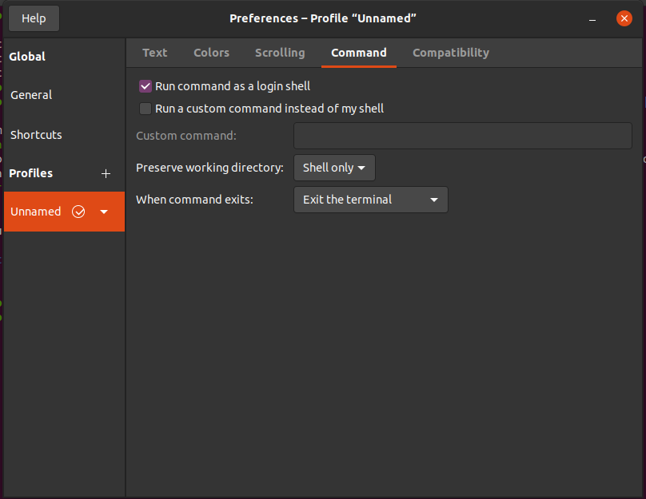

Por último, pode fechar o terminal e abrir novamente e estamos prontos para instalar o ruby:

```sh
rvm install 3.0
```

A operação pode demorar um pouco pois o rvm irá instalar todas as dependências necessárias.

Assim que finalizar, você pode testar se tudo está correto verificando a versão do ruby.

```sh
ruby --version
    > ruby 3.0.0p0 (2020-12-25 revision 95aff21468) [x86_64-linux]
```

---

1. https://medium.com/@phinfonet/primeiros-passos-com-ruby-instala%C3%A7%C3%A3o-com-rbenv-ab705559fc5c
2. https://rvm.io/rvm/install

### 5.2. Como instalar o Rails

O [Rails](https://rubyonrails.org/) é um framework web MVC que é sem dúvida o carro chefe que move a comunidade ruby.

Existe outros projetos na comunidade que usam o poder de se expressar do ruby. Mas nenhum projeto chega perto da popularidade e da importância do Rails.

Ele ganhou espaço principalmente por **pregar** o conceito de convensão sobre configuração em um momento que os desenvolvedores tinham que gastas semanas configurando XMLs para colocar um projeto Java no ar.

Mas a **doutrina** do rails vai muito além de boas convenções, ele é uma framework com opinião muito forte e aconselho todos a pararem esse livro nesse momento e lerem sobre as opiniões nesse link: https://rubyonrails.org/doctrine/.

O Rails é distribuído através de uma Gema (gem em inglês), que são a forma mais comum de encapsular código no mundo do ruby.

Na prática, além do código do seu negócio, você irá trabalhar com algumas dezenas de gemas direta ou indiretamente no seu código.

As gemas podem ser instaladas através do comando "gem install nome_gem" que já foi disponibilizado junto com a instalação do ruby pelo rvm.

```sh
gem install rails
```

Para testar se a instalação funcionou como esperado.

```sh
rails --version
    > Rails 6.1.3.1
```

Repare que junto com a instalação do rails, outras 37 gemas foram instaladas no processo, que são as dependências que o rails possui.

Iremos mais na frente aprender como gerenciar de forma mais eficiente as gemas que nosso projeto depende. Caso você queira ler mais a fundo na documentação oficial sobre a instalação do rails, segue o link: https://guides.rubyonrails.org/getting_started.html#creating-a-new-rails-project-installing-rails

---

1. https://rubyonrails.org/
2. https://rubyonrails.org/doctrine/
3. https://rubygems.org/
4. https://guides.rubyonrails.org/getting_started.html#creating-a-new-rails-project-installing-rails

### 5.3. Como instalar o NodeJS

Apesar da comunidade de javascript ter, digamos, inovado além da conta. Eles criaram as melhoras ferramentas para lidar com o frontend (afinal foi para isso que o Javascript foi criado).

E o rails não briga contra isso, muito pelo contrário, ele busca abraçar as novidades, mas colocando **convenções** nas mesmas para o desenvolvedor não ter que se preocupar com as centenas de configurações que essas novidades independentemente requerem.

Uma das mudanças recentes do Rails foi adicionar o [Webpack](https://webpack.js.org/) (não se preocupe com ele agora, o rails vai deixar ele pronto para uso) como seu gerenciador de módulos de Javascript padrão.

Por conta dessa decisão, e de outras libs de javascript que o Rails utiliza, vem a necessidade da instalação do [NodeJS](https://nodejs.org/en/).

* No Windows basta baixar o instalador no site oficial:
https://nodejs.org/en/download/

* No linux, a instalação depende da sua distribuição, mas está  tudo muito bem documentado no link
https://nodejs.org/en/download/package-manager/

Além do NodeJS, também é necessário instalar o Yarn, que é um dos seus ~~muitos~~ gerenciadores de dependência.

```sh
npm install --global yarn
```

E para verificar se a instalação funcionou:

```sh
yarn --version
    > 1.22.10
```

PS: Essa decisão de colocar o Webpack por padrão não veio [sem questionamentos](https://rossta.net/blog/why-does-rails-install-both-webpacker-and-sprockets.html), mas no fim acho que foi uma escolha sensata para abraçar os projetos que dependem de muito Javascript **no frontend**.

---

1. https://webpack.js.org/
2. https://nodejs.org/en/
3. https://nodejs.org/en/download/
4. https://nodejs.org/en/download/package-manager/
5. https://rossta.net/blog/why-does-rails-install-both-webpacker-and-sprockets.html

### 5.4. Como Instalar o SQLite
### 5.5. Editor de Código

Uma dúvida que sempre escuto de pessoas que estão iniciando uma nova linguagem de programação, é qual a IDE utilizar para programar nessa linguagem.

Para programar em Ruby, você não precisa de uma IDE que consuma mais memória do que o seu sistema operacional, um editor de texto, com destaque de sintaxe já é suficiente.

#### 5.5.1. VSCode

Porém na última década, os próprios editores de texto evoluiram e um deles, na minha humilde opinião, ganhou o espaço por balancear funcionalidades para o desenvolvedor e consumo de máquina.

E esse editor foi o [VSCode](https://code.visualstudio.com/). É o editor que eu uso no meu dia a dia profissional, ele é gratuito e se encaixa muito bem em outras extensões adjacentes que vamos usar, como o próprio Javascript, scss, e o próprio html.

Para instalar o VSCode basta entrar no site do mesmo https://code.visualstudio.com/#alt-downloads e realizar o download para o sistema operacional que você esteja utilizando.

---

1. https://code.visualstudio.com/
2. https://code.visualstudio.com/#alt-downloads

#### 5.5.2. Outros Editores

1. [**RubyMine**](https://www.jetbrains.com/pt-br/ruby/): Caso você procure um editor mais poderoso e esteja disposto a pagar por isso. O rubymine sem dúvida é o que há de melhor na comunidade.
2. [**TextMate**](https://macromates.com/): Foi onde a comunidade começou. Editor de texto poderoso, extensível, mas que infelizmente só existe para o Mac.
3. [**Sublime**](https://www.sublimetext.com/): Na linha do TextMate, editor de texto poderoso que por muito tempo foi o queridinho da comunidade.
4. [**Vim**](https://www.vim.org/): Aguns dos grandes desenvolvedores que eu conheço, optam por ficar o mais próximo possível do terminal. O vim é na minha opinião o editor mais poderoso embutido no terminal e no mínimo você deveria conhecer caso precise editar algum código dentro de um servidor, ou [tenha que fechar o mesmo](https://stackoverflow.blog/2017/05/23/stack-overflow-helping-one-million-developers-exit-vim/).
5. [**Emacs**](https://www.gnu.org/software/emacs/): Caso você queira que seu editor seja praticamente o seu sistema operacional, esse é o caminho.

---

1. https://www.jetbrains.com/pt-br/ruby/
2. https://macromates.com/
3. https://www.sublimetext.com/
4. https://www.vim.org/
5. https://stackoverflow.blog/2017/05/23/stack-overflow-helping-one-million-developers-exit-vim/
6. https://www.gnu.org/software/emacs/

## 6. O projeto

O projeto que iremos fazer durante os capítulos desse livro foi pensado para passar por diversas características diferentes que um software web pode ter.

Com isso é possível pegar o conhecimento adquirido nesse livro e transportar para outros softwares sem nenhuma dificuldade.

Foi escolhido então o desafio de desenvolver uma lista de mercado, pois é um problema que acredito que grande parte dos leitores já teve e essa experiência prévia ajuda a pensar em nova funcionalidades para serem implementadas como treino a parte desse livro.

## 7. Iniciando o projeto

O rails vem com uma série de comandos de terminal que agilizam muito o desenvolvimento do sistema, o primeiro dele é o que gera o template de um novo projeto.

```sh
rails new simple_market_list
```

Com esse comando, o rails irá criar a estrutura de diretórios da sua aplicação, além disso, irá instalar mais algumas dependências necessárias para o seu projeto rodar. Sejam as dependências de backend, as gemas, seja dependências do frontend, com o yarn.

---

1. https://guides.rubyonrails.org/getting_started.html#creating-the-blog-application

### 7.1. Estrutura de Diretórios

Ao entrar no diretório criado (simple_market_list), você verá que o rails já definiu uma série de pastas onde os seus códigos devem ir.

Acredito que seja bom você ao menos conhecer para que serve cada uma dessas paster e por isso vou colocar a descrição de cada pasta/arquivo criado automaticamente.

Mas caso você esteja ansioso para começar a programar, uma sugestão é que você pule essa parte e volte nela quando estiver relendo esse livro.

```sh
cd simple_market_list
code .
```

*"code ."* é o comando para abrir o VSCode na pasta para começarmos a desenvolver nosso projeto.

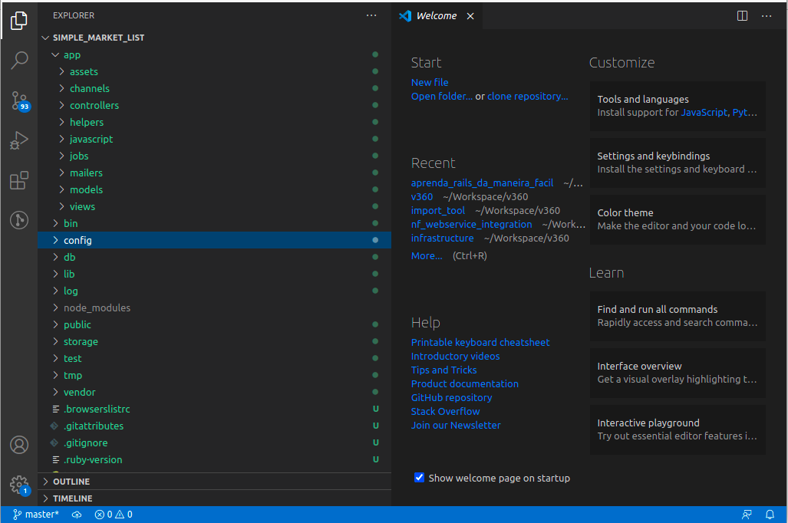

| Pasta / Arquivo                   | Propósito                                                                                                                                                                                                                                                                      |
| --------------------------------- | ------------------------------------------------------------------------------------------------------------------------------------------------------------------------------------------------------------------------------------------------------------------------------ |
| app                               | Nessa pasta é onde o código da sua aplicação irá ser colocado, é nela e na de testes que esforço deve ser gasto                                                                                                                                                                |
| > assets                          | Nesta pasta é onde suas imagens e folhas de estilo irão ser armazenados                                                                                                                                                                                                        |
| > channels                        | Mais a frente nesse livro iremos ver como atualizar a página do usuário quando algum dado no servidor mudar, é nessa pasta que estarão os canais que irão levar as informações de mudança para o usuário                                                                       |
| > controllers                     | Os controllers são a cola entre os seus modelos e suas telas (views).                                                                                                                                                                                                          |
| > helpers                         | São códigos que podem ser rodados em diferentes views. Com o objetivo de reaproveitar a lógicas.                                                                                                                                                                               |
| > javascript                      | É nessa página que o Webpacker irá buscar os seus javascript para disponibilizar os mesmos para o usuário                                                                                                                                                                      |
| > jobs                            | Dentro da estrutura do Rails nos temos o Job para realizar operações assíncronas, que não vivem dentro do ciclo de vida da requisição web                                                                                                                                      |
| > mailers                         | Os mailers são responsáveis por gerenciar os envios de e-mails da sua aplicação                                                                                                                                                                                                |
| > models                          | Aqui vive a lógica da sua aplicação, seus modelos são os responsáveis por buscar, salvar e manipular os seus dados                                                                                                                                                             |
| > views                           | As views são o que o seu usuário vê, são elas que serão processadas pelo servidor e enviadas para o browser                                                                                                                                                                    |
| bin                               | Nessa pasta reside alguns binários utilizados internamente pelo rails                                                                                                                                                                                                          |
| config                            | Convenção sobre configuração não significa 0 configuração. O rails permite alterar todas as configurações de acordo com o que seu projeto necessita e essas configurações ficam nessa pasta.                                                                                   |
| > environments                    | O Rails permite definir diversos ambientes diferentes, cada um podendo ter sua própria configuração. É comum por exemplo no ambiente de desenvolvimento você mostrar a linha que um erro ocorreu, mas você não quer que o seu usuário final veja isso no ambiente de produção. |
| > initializers                    | Ao iniciar o servidor Web o rails executa todos os códigos que estão nessa pasta.                                                                                                                                                                                              |
| > locales                         | O rails já vem preparado para você fazer um site que seja 100% traduzível, com uma ferramenta de I18n muito poderosa, é nessa pasta que fica os arquivos de tradução da sua aplicação                                                                                          |
| > webpack                         | Assim como a pasta environments, a pasta do webpack permite você configurar o mesmo para diferentes ambientes. No geral o Rails já cuidou de tudo                                                                                                                              |
| > application.rb                  | É o arquivo que todos os ambientes "herdam" por padrão                                                                                                                                                                                                                         |
| > boot.rb                         | Esse arquivo carrega todas as suas gemas.                                                                                                                                                                                                                                      |
| > cable.yml                       | É o arquivo que configura qual adaptador o ActionCable, módulo que gerencia como o rails lida com Websocket, irá usar                                                                                                                                                          |
| > credentials.yml.enc             | É normal em aplicações Web você lidar com APIKeys ou outros dados que devem permaneser secretos, mas devem ser compartilhado com todo o time. O arquivo de credêntials é um arquivo criptografado que facilita esse gerenciamente                                              |
| > database.yml                    | É o arquivo que gerencia sua conexão com o banco de dados                                                                                                                                                                                                                      |
| > environment.rb                  | É o arquivo que inicializa sua aplicação                                                                                                                                                                                                                                       |
| > master.key                      | Esse arquivo **não** deve ser versionado, é ele que descriptografa o arquivo de credenciais                                                                                                                                                                                    |
| > puma.rb                         | O rails usa por padrão o webservice puma. É um webservice muito poderoso e é o usado normalmente também em produção. Esse é o arquivo que configura o mesmo                                                                                                                    |
| > routes.rb                       | O arquivo de rotas é o que recebe a requisição Web e decide qual controller#action(método do controller) chamar.                                                                                                                                                               |
| > spring.rb                       | O spring é uma ferramenta introduzida recentemente pelo rails para agilizar a inicialização do sistema.                                                                                                                                                                        |
| > storage.yml                     | Esse arquivo é o responsável por informar para o Rails como/onde anexar seus arquivos.                                                                                                                                                                                         |
| > webpacker.yml                   | É o arquivo de configuração padrão do webpacker                                                                                                                                                                                                                                |
| db                                | É a pasta onde o código referente ao seu banco de dado vai. Vamos ver ela mais a fundo quando falarmos de migração                                                                                                                                                             |
| > seed.rb                         | Esse arquivo é usado para popular o seu banco de dados com dados iniciais que sejam necessários para sua aplicação funcionar                                                                                                                                                   |
| lib                               | Nessa pasta vão extensões do seu código                                                                                                                                                                                                                                        |
| > assets                          | Bibliotecas de frontend que não fazem parte diretamente do seu projeto. Por exemplo uma biblioteca interna da sua empresa que é compartilhada entre diversos projetos devem vir aqui.                                                                                          |
| > tasks                           | Nessa pasta vão as suas Rake tasks, vamos falar um pouco de rake tasks ao longo desse livro. Mas resumidamente são uma maneira simples de criar rotinas que podem ser chamadas na linha de comando.                                                                            |
| log                               | Nesta pasta irá os logs da sua aplicação                                                                                                                                                                                                                                       |
| node_modules                      | Nesta pasta irá as bibliotecas baixadas pelo Yarn                                                                                                                                                                                                                              |
| public                            | Nesta pasta irá o código público e estático da sua aplicação, que pode ser acessado diretamente sem passar por nenhuma camada do rails.                                                                                                                                        |
| storage                           | Está é a pasta padrão onde os arquivos que forem feitos uploads pela sua aplicação vão parar                                                                                                                                                                                   |
| test                              | Esta pasta vai conter os testes automatizados da sua aplicação                                                                                                                                                                                                                 |
| > channels                        | Está pasta irá os testes automatizados dos seus canais                                                                                                                                                                                                                         |
| > controllers                     | Está pasta irá os testes automatiados dos seus controllers                                                                                                                                                                                                                     |
| > fixtures                        | Está pasta irá os dados que seus testes irão carregar no banco de dados. Após cada teste, o banco sempre volta para o estado definido nos fixtures                                                                                                                             |
| > helpers                         | Está pasta irá os testes automatizados dos seus helpers                                                                                                                                                                                                                        |
| > integration                     | Aqui vão os testes pre tendendem testar como várias partes da aplicação se integram                                                                                                                                                                                            |
| > mailers                         | Está pasta irá os testes automatizados dos seus mailers                                                                                                                                                                                                                        |
| > models                          | Está pasta irá os testes automatizados dos seus modelos                                                                                                                                                                                                                        |
| > system                          | Está pasta irá os testes que simulam a utilização do usuário. Necessário um browser sem interface gráfica                                                                                                                                                                      |
| > application_system_test_case.rb | Este arquivo configura qual motor será usado para os testes de sistema                                                                                                                                                                                                         |
| > test_helper.rb                  | Este arquivo vão os métodos comuns que todos os testes podem executar                                                                                                                                                                                                          |
| tmp                               | Está pasta é uma pasta temporária da sua aplicação, os arquivos contidos nela deveriam poder ser deletados                                                                                                                                                                     |
| > cache                           | Está pasta é onde os caches da sua aplicação, se forem definidos para serem salvos em arquivo, vão parar                                                                                                                                                                       |
| > miniprofiler                    | Está pasta é onde os arquivos temporários da gema rack-mini-profiler vão parar                                                                                                                                                                                                 |
| > pids                            | Quando o puma inicia um servidor, ele gera um pid para evitar que dois serviços sejam rodados                                                                                                                                                                                  |
| > storage                         | Está pasta conterá os arquivos temporários criados para realizar upload                                                                                                                                                                                                        |
| > development_secret.txt          | O rails possui uma chave secreta para assinar os cookies criados (ou qualquer coisa que você deseje encriptar), em desenvolvimento/test essa chave é gerada randomicamente nesse arquivo                                                                                       |
| vendor                            | Esta pasta vão os códigos de terceiros que não estão encapsulados em gemas                                                                                                                                                                                                     |
| .browserslistrc                   | Este arquivo descreve quais browsers sua aplicação suporta                                                                                                                                                                                                                     |
| .gitattributes                    | Este arquivo é onde configuramos atributos do git, por padrão o rails marca alguns arquivos para não entrarem na estatistica de linguagem do repositório                                                                                                                       |
| .gitignore                        | Este arquivo contem os arquivos que devem ser ignorados pelo seu sistema                                                                                                                                                                                                       |
| .ruby-version                     | Este arquivo contem a versão do ruby que deve ser usada para rodar seu sisema. Com esse arquivo o rvm já sabe automaticamente qual ruby usar caso você possua mais de um.                                                                                                      |
| babel.config.js                   | Esse é o arquivo de configuração do Babel que é usado para portar o código de javascript moderno para versões antigas dos browsers.                                                                                                                                            |
| config.ru                         | Esse arquivo configura o Rack, que é o middleware utilizado pelo rails para tratar as requisições web. Com o rack é possível por exemplo você ter certeaz requisições sendo processadas pelo Rails e outras por uma outra framework qualquer (Não faça isso)                   |
| Gemfile                           | Esse arquivo vão as gemas que sua aplicação precisa                                                                                                                                                                                                                            |
| Gemfile.lock                      | Após instalar as gemas, as versões instaladas vão para esse arquivo, com o intuito de garantir que todos que estão no projeto utilizem a mesma versão                                                                                                                          |
| package.json                      | Esse arquivo vão as bibliotecas de javascript que sua aplicação precisa                                                                                                                                                                                                        |
| postcss.config.js                 | Esse arquivo é utilizado pelo webpacker para configurar o postcss                                                                                                                                                                                                              |
| Rakefile                          | Esse arquivo é carregado quando você roda as suas tasks criadas dentro da pasta lib                                                                                                                                                                                            |
| README.md                         | Esse é o arquivo que deveria ir o mínimo que os desenvolvedores deveriam saber sobre seu projeto                                                                                                                                                                               |
| yarn.lock                         | Após instalar as bibliotecas de javascript, as versões instaladas vão para esse arquivo, com o intuito de garantir que todos que estão no projeto utilizem a mesma versão                                                                                                      |

Como você pode ver o Rails tomou algumas dezenas de decisões, seja de gemas padrões, estrutura de pastas, configurações padrões dessas gemas, etc.

Durante a vida de um projeto, é comum que algumas dessas configurações sejam alteradas para atender a necessidade do mesmo.

Mas essa decisão de alteração deve ser tomada conforme o projeto cresce e suas especificidades vão surgindo, um desenvolvedor não deveria ter que se preocupar com elas antes mesmo de gerar uma única tela.

## 8. Tela de Listas de Mercado

Agora que já estamos, no terminal, dentro da pasta do projeto, vamos iniciar o servidor

```sh
rails s
```

O *rails s* é uma abreviatura de *rails server*

Agora entre no seu browser preferido e acesse a url: http://127.0.0.1:3000

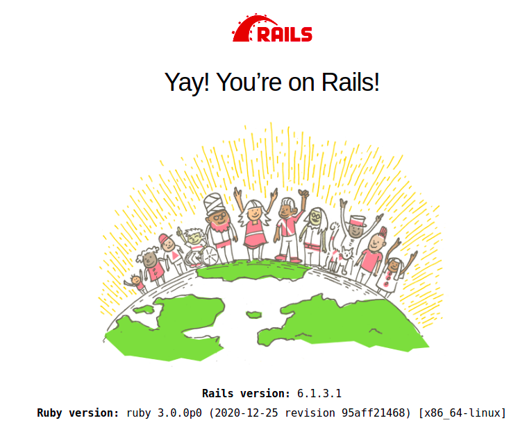

Pronto, agora podemos começar a escrever nossa própria aplicação.

### 8.1. Gerando o primeiro Controller

O rails vem com uma série de geradores de código ([generators](https://guides.rubyonrails.org/command_line.html#bin-rails-generate)) que ajudam a gerar o código minimo que precisamos para uma determinada tarefa.

Nesse caso vamos utilizar o generator de controller:

Nesse momento, pare o servidor utilizando "ctrl+c" no terminal e rode

```sh
rails g controller market_lists
```

*rails g* é a abreviatura de *rails generate*

Um ponto importante para se perceber é que o nome do controller está no plural. Essa é uma das convensões do rails.

Após executar esse comando, o rails irá criar alguns arquivos para você.

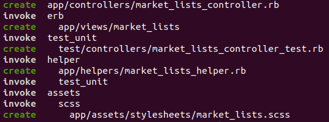

* O market_lists_controller.rb é onde irá o seu código de controller propriamente dito.
* A pasta views/market_lists é onde deverão ir os arquivos de visualização do seu controller.
* O market_lists_controller_test é onde os testes automatizados do seu controller irão residir
* market_lists_helper os métodos de helper específicos do seu controller
* E por fim o market_lists.scss para caso o seu controller tenha alguma folha de estilo específica

Você pode rodar o comando

```sh
rails generate controller --help
```

Para ter acesso a mais opções caso você queira evitar que alguns desses arquivos seja gerado.

---

1. https://guides.rubyonrails.org/command_line.html#bin-rails-generate

#### 8.1.1. Explicando o conceito do Controller

Conforme já falamos anteriormente, o controller é a cola entre o seu modelo e suas views. É ele quem vai receber as requisições http e decidir quais modelos chamar e quais views apresentar para o usuário.

Ele pode decidir por exemplo apresentar os dados de um controller como um json caso a requisição seja uma chamada de API, renderizar um html caso seja uma chamada direta do browser ou redirecionar por exemplo para a tela de login se o usuário não estiver logado.

Mas cuidado para não colocar lógica de negócio dentro do seu controller. A boa prática é que ele passe as informações necessárias para a camada de modelo, esse com as regras de negócio e baseado no que o modelo retornar, ele tome as decisões.

Chamamos essa prática de ["Fat Model, Skinny Controller"](https://riptutorial.com/ruby-on-rails/example/9609/fat-model--skinny-controller), mas cuidado para seu modelo não ficar ["muito gordo"](https://thoughtbot.com/blog/skinny-controllers-skinny-models).

---

1. https://riptutorial.com/ruby-on-rails/example/9609/fat-model--skinny-controller
2. https://thoughtbot.com/blog/skinny-controllers-skinny-models

### 8.2. Escrevendo teste automatizado do Controller

O próximo passo é escrever o teste automatizado para esse controller, nós queremos que o usuário ao entrar na url da raiz do projeto "/" ou a url "/market_lists" venha escrito "Suas listas de Mercado" e, por enquanto, "Você ainda não possui nenhuma lista".

Abra o arquivo "test/controllers/market_lists_controller_test.rb" que deve estar inicialmente assim:

```rb
require "test_helper"

class MarketListsControllerTest < ActionDispatch::IntegrationTest
  # test "the truth" do
  #   assert true
  # end
end
```

Agora vamos adicionar os (testes)[https://guides.rubyonrails.org/testing.html#functional-tests-for-your-controllers] que descrevem as necessidades apresentadas anteriormente

```rb
require "test_helper"

class MarketListsControllerTest < ActionDispatch::IntegrationTest
  test "Should show Your Market List as title if access root" do
    get root_path
    assert_response :success
    assert_select "h1", text: "Suas listas de Mercado"
  end

  test "Should show Your Market List as title if access specific url" do
    get market_lists_path
    assert_response :success
    assert_select "h1", text: "Suas listas de Mercado"
  end

  test "Should show you don't have any list if don't have any list if access root" do
    get root_path
    assert_response :success
    assert_select "p", text: "Você ainda não possui nenhuma lista"
  end

  test "Should show you don't have any list if don't have any list if access specific url" do
    get market_lists_path
    assert_response :success
    assert_select "p", text: "Você ainda não possui nenhuma lista"
  end
end
```

E rodar os testes

```
 rails test
```

Muito provavelmente nesse momento você vai ter um [erro](https://stackoverflow.com/questions/65479863/rails-6-1-ruby-3-0-0-tests-error-as-they-cannot-load-rexml) dizendo que o Rails não consegue rodar por conta da auxência do 'rexml/document'. Essa é uma gema que foi tirada do padrão do Ruby 3.0.

Abra o arquivo Gemfile e embaixo da linha "ruby '3.0.0'" adicione

```rb
gem 'rexml'
```

E agora rode

```sh
bundle
```

Esse comando irá instalar a gema descrita. E agora podemos rodar novamente:

```sh
rails test
```

Dessa vez os testes vão travar pois não temos o arquivo schema.rb criado. Esse é um arquivo gerado automaticamente pelo rails quando rodamos o comando:

```sh
rails db:migrate
```

Não se preocupe, iremos olhar mais a fundo esses comandos mais a frente.

```sh
rails test
```

Agora os seus testes devem ter rodado, mas, obviamente, sem encontrar os métodos 'root_path' e 'market_lists_path' que usamos nele.

```
Finished in 0.202442s, 19.7587 runs/s, 0.0000 assertions/s.
4 runs, 0 assertions, 0 failures, 4 errors, 0 skips
```

Nesse momento nossos testes estão vermelhos e isso é o esperado.

---

1. https://guides.rubyonrails.org/testing.html#functional-tests-for-your-controllers
2. https://stackoverflow.com/questions/65479863/rails-6-1-ruby-3-0-0-tests-error-as-they-cannot-load-rexml

#### 8.2.1. A importância dos Testes

Apesar do Rails e seu criador ([@DHH](https://twitter.com/dhh)) [não pregarem](https://dhh.dk/2014/tdd-is-dead-long-live-testing.html) exatamente [Test-Driven-Development](https://martinfowler.com/bliki/TestDrivenDevelopment.html), ninguém na comunidade vai descordar da importância de se ter testes.

Seu código tem que ser testado por máquinas e a melhor forma de garantir isso é seguir a prática de "red-green-blue" (vermelho-verde-azul), onde você primeiro escreve o teste, faz ele passar e depois repensa no seu código para ele ser o mais otimizado possível, com a segurança que ele não quebrou nada.

Os testes no longo prazo vão permitir você mudar o comportamento de uma parte do sistema sabendo que não quebrou outra.

Os testes vão servir como uma documentação testável da sua aplicação. Onde um desenvolvedor vai poder entender qual a lógica esperada de uma determinada classe, sem ter que entende-lo.

Repare no código que escrevemos:

```rb
class MarketListsControllerTest < ActionDispatch::IntegrationTest
  test "Should show Your Market List as title if access root" do
    (...)
  end

  test "Should show Your Market List as title if access specific url" do
    (...)
  end

  test "Should show you don't have any list if don't have any list if access root" do
    (...)
  end

  test "Should show you don't have any list if don't have any list if access specific url" do
    (...)
  end
end
```

A idea é que seu código descreva para um humano o comportamento de uma classe.

E vai ser seguindo essa ideia que vamos escrever o restante desse livro.

---

1. https://twitter.com/dhh
2. https://dhh.dk/2014/tdd-is-dead-long-live-testing.html
3. https://martinfowler.com/bliki/TestDrivenDevelopment.html

### 8.3. Roteando a requisição

O caminho dos dados da sua aplicação começa sempre no routes.rb. É ele que o Rails vai olhar para saber para onde enviar a requisição HTTP que chegar no servidor.

O caminho GET /market_lists vai ser apontado para o controller market_lists_controller, já o GET /items vai para o controller items_controller.

O caminho GET / vai também para o market_lists_controller.

É nesse arquivo que vamos razer esse mapeamento de DeXPara.

---

Para isso, edite o seu arquivo routes.rb

e adicione as linhas

```rb
Rails.application.routes.draw do
  # For details on the DSL available within this file, see https://guides.rubyonrails.org/routing.html
  resources :market_lists
  root to: 'market_lists#index'
end
```

E assim o Rails vai criar os mapeamentos necessários para o seu recurso de market_lists, gerando uma API Restful.

Para saber mais sobre as rotas:

---

1. https://guides.rubyonrails.org/routing.html

#### 8.3.1. O que é uma API RESTFUL?

A arquitetura de comunicação REST foi proposta por Roy Fielding em sua tese de [doutorado em 2000](https://www.ics.uci.edu/~fielding/pubs/dissertation/rest_arch_style.htm).

Essa arquitetura, ao invés de determinar como uma API deve ser construída, ela define algumas limitações que a api deve ter.

São elas:

1. Parte de nenhuma limitação

Nenhuma outra limitação prévia é necessária

2. Client-Server

O cliente não pode conhecer previamente nenhuma especificidade do servidor e o servidor não pode conhecer nenhuma especificidade do cliente.

Podendo os dois evoluírem separadamente

3. Stateless

O servidor não pode guardar estado, o que obriga que todas as informações necessárias para se obter a resposta tem que estar contida na mensagem.

Com esse limitação é possível escalar o servidor de maneira simples, dado que cada nó sempre vai ter todas as informações necessárias para processar a requisição.

4. Cache

As respostas do servidor devem poder ser marcadas como “cacheáveis” ou não.

5. Interface uniforme

A interface de comunicação deve ser uniforme entre os componentes da rede. Não existe diferença no formato da mensagem se você está trafegando um vídeo ou um texto.

6. Comunicação em camada

Ser possível adicionar camadas de recebedores entre as partes.

---

Além das restrições impostas pelo REST, ela define alguns atributos que a comunicação deve ter:

1. Recurso

O recurso é o elemento conceitual da requisição: “Listas de mercado”, “Item da Lista”, “Última lista”, etc

2. A url que aponta para esse recurso

/market_lists -> Listas de mercado
/market_list/1/items/2 -> Item com id 2, da lista com id 1
/last_market_list -> Retorna a última lista de mercado do usuário

3. Representação

Como esse recurso vai ser apresentado? Um html, JSON, uma imagem, Excel, um csv, etc.

4. Metadados da Representação

Data que foi alterada pela última vez, tipo da mídia, etc.

5. Metadados do Recurso

Link de url alternativo, variedade, etc

6. Controle do Dado

Se deve ser cacheado, o propósito e o significado da mensagem.

---

Em cima dessas restrições, foi criado o [Richardson Maturity Model](https://martinfowler.com/articles/richardsonMaturityModel.html), que é um modelo para saber a maturidade da sua API em relação ao REST.

Nesse modelo você precisa ter 4 níveis:

1. Level 0

Usar somente o HTTP como mecanismo de transferência.

2. Level 1

A sua API aponta para os recursos usando a URL.

3. Level 2

Usar os verbos do HTTP como diferenciador da requisição. Uma requisição GET busca dados, uma requisição POST envia dados.

4. Level 3

A URL representar o estado da aplicação: "/market_lists?open=true" trazer somente as listas abertas e "/market_lists?open=false" trazer somente as fechadas.

Atingir o 3 nível é o que consideramos o que temos de melhor na internet até hoje (desculpe pessoal do GraphQL).

---

Como esperado, o Rails já vem preparado para ajudar vocês fazer a sua aplicação ser Restful respeitando de maneira simples todas as restrições e utilizando da melhor forma possível os atribútos que o próprio protocolo da WEB já fornece.

---

1. https://www.ics.uci.edu/~fielding/pubs/dissertation/rest_arch_style.htm


2. https://martinfowler.com/articles/richardsonMaturityModel.html


#### 8.3.2. Usando rails routes

Para verificar quais rotas foram geradas pelo Rails na etapa anterior, o mesmo fornece um atalho no terminal

```sh
rails routes
```

No terminal você vai ver que o rails listou tanto as suas rotas, quanto as rotas criadas por ele para o activestorage por exemplo.

Para filtrar somente suas rotas

```sh
rails routes | grep market_list
    market_lists GET    /market_lists(.:format)                                                                           market_lists#index
                    POST   /market_lists(.:format)                                                                           market_lists#create
    new_market_list GET    /market_lists/new(.:format)                                                                       market_lists#new
edit_market_list GET    /market_lists/:id/edit(.:format)                                                                  market_lists#edit
        market_list GET    /market_lists/:id(.:format)                                                                       market_lists#show
                    PATCH  /market_lists/:id(.:format)                                                                       market_lists#update
                    PUT    /market_lists/:id(.:format)                                                                       market_lists#update
                    DELETE /market_lists/:id(.:format)                                                                       market_lists#destroy
            root GET    /                                                                                                 market_lists#index
```

O comando grep filtra o retorno de um outro comando no terminal.

Repare que o rails separa a sua requisição em alguns blocos:

market_lists GET    /market_lists(.:format) market_lists#index

1. market_lists -> É um helper que pode ser chamado na sua aplicação para apontar para a sua rota, é comum usar esses helpers para montar as urls quando necessário. Ele pode ser sufixado com _path onde ele vai por somente o /market_lists ou com _url onde ele vai por toda a url como http://localhost:3000/market_lists

2. GET -> É o método HTTP usado

3. /market_lists(.:format) -> É a url que vai chegar na requisição para ativar essa linha

4. market_lists#index -> É o controller e a #action que vai ser chamado

Agora, se você rodar novamente seus testes

```sh
rails test
```

E você vai ver que agora o erro que vai ser dado é que a action não está definida no seu controller.

### 8.4. Escrevendo a primeira Action

As actions nada mais são do que os métodos dos controllers, elas podem ter qualquer nome, porém é uma boa prática que os controllers possuam no máximo as seguintes actions:

1. index
A action que vamos criar agora é a responsável por listar os recursos necessários

2. show
Essa action é a responsável por mostrar os detalhes de um único recurso selecionado

3. new
Essa action é a responsável por mostrar o formulário de criar um novo recurso

4. create
Essa action é a responsável por salvar os dados do formulário de criação

5. edit
Essa action é a responsável por mostrar o formulário de edição

6. update
Essa action é a responsável por salvar os dados do formulário de edição

7. destroy
Essa action é a responsável por deletar um recurso do banco

Se retringir somente a essas actions e quebrar em mais controllers quando necessário [ajudam a manter o código fácil de entender](http://jeromedalbert.com/how-dhh-organizes-his-rails-controllers/), permitindo que olhando somente para a url da requisição, qualquer desenvolvedor que conheça a estrutura do Rails saiba qual controller/action a requisição está chamando. Quando é necessário algum método além desses 7, normalmente é a hora de criar um novo controller.

```sh
The action 'index' could not be found for MarketListsController
```

Voltando a action index que o nosso teste está pedindo, dentro do nosso controller, vamos criar o método index:

```rb
class MarketListsController < ApplicationController
  def index
  end
end
```

Ao rodar os testes novamente:

```sh
rails test
    (...)
    (...)MarketListsController#index is missing a template for request formats: text/html
    (...)
```

Agora os testes apontam que ele não encontrou o template no formato html para renderizar.

------------

1. http://jeromedalbert.com/how-dhh-organizes-his-rails-controllers/


### 8.5. Escrevendo a primeira View

Aqui entramos novamente em convenção sobre configuração.

A primeira dela é que a rota gerada para o index ('rails routes | grep market_list' caso você queira verificar a informação) diz que você pode passar o formato esperado pelo template.

```sh
market_lists GET /market_lists(.:format) market_lists#index
```

Como não passamos nenhum formato específico, como por exemplo .json, o rails espera renderizar um template html.

A segunda convenção sobre configuração é que as actions por **padrão** renderiza o template que esteja na pasta dentro de views/nome_do_controller/nome_da_action.formato.processador

Nesse nosso caso, views/market_lists/index.html.erb

O [ERB](https://docs.ruby-lang.org/en/2.3.0/ERB.html) é um acrônimo para Embedded Ruby Template, ele permite adicionar código ruby dentro do seu template html.

O ERB já vem imbutido dentro do ruby e é o processador padrão do Rails.

Nesse artigo vamos nos ater a ele, mas, para conhecimento, existem outros processadores como o [slim](http://slim-lang.com/), [haml](https://haml.info/) que são concorrentes diretos do erb e alguns que não são voltados para html, mas sim outros formatos, como o [axlsx](https://github.com/caxlsx/caxlsx_rails) que é voltado para renderizar arquivos em excel.

Pessoalmente acho que a diferença entre o ERB, Slim e Haml é nada mais do que gosto pessoal de quem desenvolveu cada um deles e nesse caso, costumo escolher o que vem por padrão no rails.

Após criar o arquivo index.html.erb dentro de app/market_lists/

Rode o teste novamente:

```sh
rails test
```

Agora nossos testes estão reclamando que nosso arquivo não possui o elemento html h1 e um elemento html p

Vamos arrumar esse problema agora

```html
<h1></h1>
<p></p>
```

Rode o teste novamente:

```sh
rails test
```

O erro agora mudou dizendo que o texto esperado não se encontra dentro dos elementos h1 e p.

Editamos o arquivo agora para:

```html
<h1>Suas listas de Mercado</h1>
<p>Você ainda não possui nenhuma lista</p>
```

Rode o teste novamente:

```sh
rails test
    (...)
    Finished in 0.203206s, 19.6844 runs/s, 39.3688 assertions/s.
    4 runs, 8 assertions, 0 failures, 0 errors, 0 skips
```

Pronto, agora que todos os nossos testes passaram, podemos dar uma olhada no browser.

```sh
rails s
```

Agora se você acessar sua página local, irá ver que a imagem de "You are on Rails" deu lugar a nossa página recem construída.

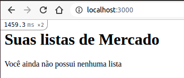

Tembém é possível notar um pequeno número no canto superior esquerdo.

Esse número é o profiler do rails, ele indica quanto tempo a sua página demorou para carregar e clicando nele, é possível ver o porque a sua página demorou aquele tempo.

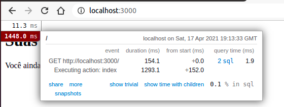

Agora, também acessando a página /market_lists, também caímos na mesma página.

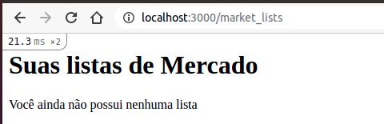

O tempo consideravelmente menor se dá pois o rails verifica na primeira vez que o servidor é requisitado uma série de operações são realizadas, como, por exemplo, se você rodou todas as migrações do seu banco de dados ou está com seus assets disponibilizados corretamente para o servidor.

---

1. https://docs.ruby-lang.org/en/2.3.0/ERB.html
2. http://slim-lang.com/
3. https://haml.info/
4. https://github.com/caxlsx/caxlsx_rails

## 9. Verificando a cobertura de Testes, Sintaxe e Segurança

Até o momento, fizemos um desenvolvimento guiado pelo teste que escrevemos. Porém em projetos maiores, envolvendo vários desenvolvedores e algumas dezenas de milhares de linhas de código é fácil esquecer de testar algum if, ou mesmo ao refatorar uma parte do código, fazer com que ela deixe de ser coberta.

Outro problema que também encontramos em projetos maiores do que o desse livro, são os desenvolvedores não seguindo um mesmo [estilo de código](https://github.com/rubocop/ruby-style-guide) (tamanho da identação, espaço depois da virgula, número de linhas entre os os métodos e outras boas práticas que parecem bobeira, mas que deixa o código mais legível).

E por fim, é possível que até mesmo em projetos pequenos, o desenvolvedor se descuide e insira algum código vulnerável sem se dar conta.

Para resolver esses problemas, a comunidade disponibiliza gemas que fazem análise do nosso código e geram os alertas necessários para que façamos as correções antes de entregar o software para o cliente final.

----

1. https://github.com/rubocop/ruby-style-guide

### 9.1. O que são Gemas

Conforme já falado anteriormente nesse livro, as gemas são nada mais do que uma forma de você encapsular e distribuir código ruby.

Existem milhares de gemas disponíveis para ajudar o desenvolvedor a atingir o seu objetivo.

O próprio rails é uma gem, que por usa vez tem como dependência outras dezenas de gemas.

A sua utilização varia de coisas complexas como frameworks, até coisas mais simples como, fazer chamadas http, ou fazer conexão com bancos diferentes.

Porém tome cuidado, é comum as pessoas iniciando no mundo do rails buscarem gemas para resolver todos os problemas e possivelmente vão achar uma que realmente resolva.

Mas cada nova dependência no seu projeto é uma possível fonte de problema no futuro para [atualizar o código](https://github.blog/2020-08-25-upgrading-github-to-ruby-2-7/), [compatibilidade de licença](https://dev.to/cseeman/what-s-up-with-mimemagic-breaking-everything-he1) ou possível [falha de segurança](https://stackoverflow.com/questions/56712510/github-warns-security-problem-about-omniauth-gem).

Por isso é sempre importante tentar ficar com o que o rails/ruby já fornecem para você, mas caso tenha algo em específico que você precisa, verificar se a gema ainda é mantida, tem um aval da comunidade são boas práticas para escolher qual dependência adicionar no seu projeto.

———

* https://github.blog/2020-08-25-upgrading-github-to-ruby-2-7/
* https://github.blog/2018-09-28-upgrading-github-from-rails-3-2-to-5-2/
* https://dev.to/cseeman/what-s-up-with-mimemagic-breaking-everything-he1
* https://stackoverflow.com/questions/56712510/github-warns-security-problem-about-omniauth-gem


#### 9.1.1. RubyGems

O site da [Rubygem](https://rubygems.org/gems) é o centralizador de todas as gemas públicas.

Se você olhar no seu arquivo ```Gemfile```, verá que a primeira linha dele é

```rb
source 'https://rubygems.org'
```

Isso indica que quando o bundle for instalar uma gema, é no site rubygems que ele vai buscar.

O problema é que o site Rubygem tem no máximo a lista das gemas mais baixadas, mas sem uma categorização ou outros dados importantes para escolhar qual gema colocar no projeto.

---
* https://rubygems.org/gems
#### 9.1.2. RubyToolbox

Por isso a comunidade criou o [Ruby Toolbox](https://www.ruby-toolbox.com/) para categorizar as Gemas e dar informações para você escolher qual gema utilizar.

Nele é possível buscar gemas por categoria ou pelo nome da gema, mas compartar informações como a frequêcia de atualização, quantidade de projetos que usam a gema, entre outros pontos.

---

* https://www.ruby-toolbox.com/

### 9.2. Cobertura de Teste

Para começar nossa jornada com Gemas, iremos adicionar uma para verificar qual a nossa cobertura de testes do nosso projeto atual.

Para isso, iremos entrar na categoria de [Cobertura de Testes (em inglês Code Coverage)](https://www.ruby-toolbox.com/categories/code_coverage) do Ruby Toolbox.

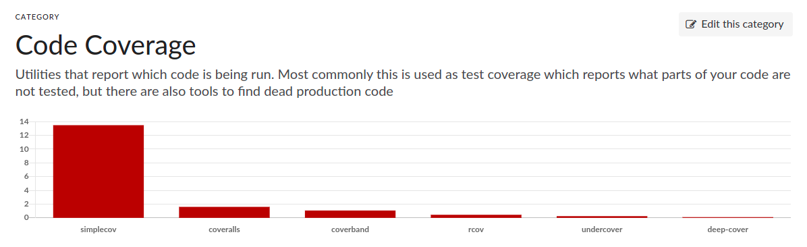

Como podemos ver, de longe a gema mais usada para essa categoria é a simplecov e é ela que vamos instalar no nosso projeto.

Acessando a [página da gema](https://github.com/simplecov-ruby/simplecov) temos a seguinte instrução de instalação:

Adicione no seu ```Gemfile``` a linha:

```rb
(...)
gem 'simplecov', require: false, group: :test
```

Adicione no início do arquivo ```test/test_helper.rb```

```rb
require 'simplecov'
SimpleCov.start 'rails'
Rails.application.eager_load! # Necessário por conta do spring

(...)
```

A última linha que adicionamos [é necessária](https://github.com/simplecov-ruby/simplecov#want-to-use-spring-with-simplecov) pois o Rails 6 utiliza o spring como forma de diminuir o tempo de Boot.

Mas como o Rails está sempre buscando se simplificar, ao perceber que em PCs mais novos o spring não traz tanto ganho, o mesmo [não virá como padrão no Rails 7](https://github.com/rails/rails/pull/42997).

Agora rode no terminar o comando

```sh
bundle install
```

E finalmente, execute os testes novamente

```sh
rails test
  Finished in 0.202135s, 19.7887 runs/s, 39.5775 assertions/s.
  4 runs, 8 assertions, 0 failures, 0 errors, 0 skips
  simple_market_list/coverage. 15 / 15 LOC (100.0%) covered.
```

Nesse momento do projeto estamos com 100% de cobertura de teste.

Para sabermos quais linhas estão cobertas e quais não estão, o Simplecov gera uma pasta chamada ```coverage``` e dentro dela existe um arquivo index.html que detalha exatamente o que já testamos.

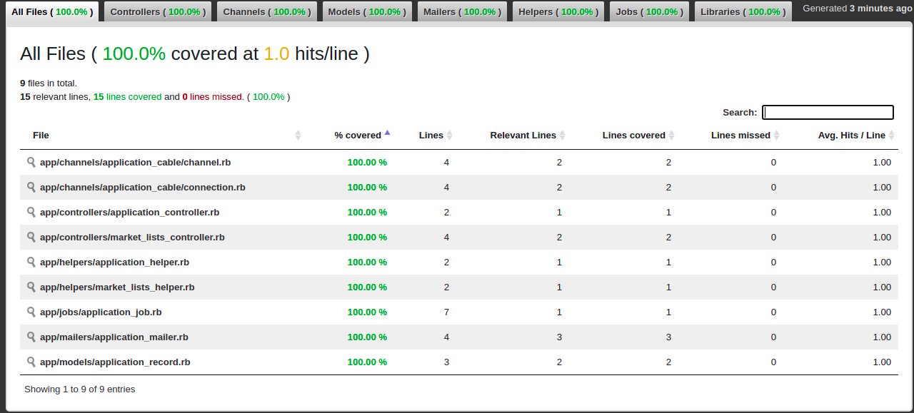

Para garantir que a gente não perca a facha de 100% de cobertura, iremos mais uma configuração no simplecov.

```rb
require 'simplecov'

SimpleCov.start 'rails' do
  minimum_coverage 100
end

Rails.application.eager_load! # Necessário por conta do spring

(...)
```

Assim, sempre que a gente esquecer de tester alguma linha, ele retornar um erro nos avisando disso.

---

* https://www.ruby-toolbox.com/categories/code_coverage
* https://github.com/simplecov-ruby/simplecov
* https://github.com/simplecov-ruby/simplecov#want-to-use-spring-with-simplecov
* https://github.com/rails/rails/pull/42997

### 9.3. Análise Estática do Código

Uma segunda preocupação que temos que ter, é se todos estão usando a mesma convenção de código.
Alguns exemplos mais simples são a utilização de 2 espaços e não 4 para identação, e pular sempre uma e não mais que uma linha entre os métodos.

Usando o mesmo processo de buscar gemas do Simplecov, vamos olhar agora a categoria de [métricas de código (Code Metrics em Inglês)](https://www.ruby-toolbox.com/categories/code_metrics).

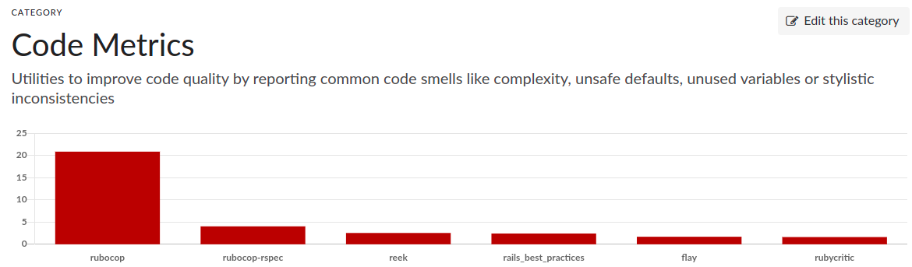

Podemos ver que a Gema mais utilizada é a Rubocop, então é ela que vamos instalar no nosso projeto.

Seguindo a [documentação oficial](https://github.com/rubocop/rubocop)

No nosso arquivo ```Gemfile``` iremos adicionar a linha

```rb
gem 'rubocop', require: false
gem 'rubocop-rails', require: false
```

Agora, podemos rodar o bundle install no terminal:

```sh
bundle install
```

Crie o arquivo ```.rubocop.yml``` na raiz do prjeto, é nele que vão as configurações do rubocop.

E adicione a linha:

```yml
require: rubocop-rails
```

E por fim, rodar

```sh
rubocop
  36 files inspected, 97 offenses detected, 90 offenses auto-correctable
```

Repare que o mesmo retornou que nosso código possui 97 ofensas ao [ruby style guide](https://github.com/rubocop/ruby-style-guide).

Uma das funcionalidades do Rubocop é corrigir esses errors automaticamente quando possível.

```sh
rubocop -a
  36 files inspected, 47 offenses detected, 41 more offenses can be corrected with `rubocop -A`
```

O comando -a corrige somente o que o rubocop considera seguro de corrigir, o -A corrige todos os problemas.

Para o intuito desse livro, vamos rodar agora o -A. Para ocorrências futuras, recomendo sempre olhar exatamente o que será corrigido.

```sh
rubocop -A
  36 files inspected, 85 offenses detected, 79 offenses corrected
```

Se rodarmos novamente iremos ver o que sobrará:

```sh
rubocop
  36 files inspected, 6 offenses detected
```

Ele agora está reclamando que algumas classes do seu projeto não possuem documentação. Apesar de ser uma boa recomendação, vamos ignorar essa regra agora.

Para isso, acesse o ```.rubocop.yml``` novamente e adicione as linhas:

```yml
(...)

Style/Documentation:
  Enabled: false
```

Rodando o rubocop novamente:

```sh
rubocop
  config/environments/development.rb:21:6: C: Rails/FilePath: Please use Rails.root.join('path/to') instead
  36 files inspected, 1 offenses detected
```

Por fim, o rubocop [mudou o entendimento dele](https://github.com/rubocop/rubocop-rails/issues/195) do que é esperado para a concatenar caminhos de arquivo.

Apesar de entender o motivo pelo qual o rubocop mudou o ruby style guide, ainda prefiro (aqui entra gosto pessoal) o jeito antigo.

Matendo a coerência do livro, podemos alterar o arquivo apontado ```config/environments/development.rb``` linha 21 para

```rb
  if Rails.root.join('tmp/caching-dev.txt').exist?
```

Caso você assim como eu, prefira a maneira antiga que estava sendo utilizada pelo próprio rails, podemos alterar a configuração do rubocop (```.rubocop.yml```) adicionando as linhas:


```yml
(...)
Rails/FilePath:
  EnforcedStyle: arguments
  Enabled: true
```

Em ambas as situações agora teremos:

```sh
rubocop
36 files inspected, no offenses detected
```

O importante é que no final, todos estejam usando a mesma forma e o rubocop garente isso.

---
* https://www.ruby-toolbox.com/categories/code_metrics
* https://github.com/rubocop/rubocop
* https://github.com/rubocop/ruby-style-guide
* https://github.com/rubocop/rubocop-rails/issues/195

### 9.4. Segurança

Por último, é importante que garantir a segurança do projeto e que ninguém acabe adicionando de maneira intensional códigos que podem ser vulneráveis.

Para garantir esse ponto, iremos entrar na categoria de [ferramentas de segurança (Security Tools em Inglês)](https://www.ruby-toolbox.com/categories/security_tools)


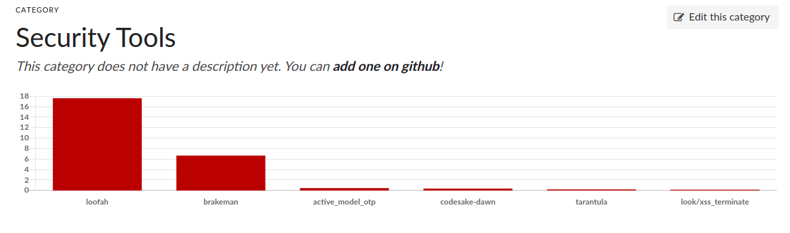

Nesse caso, a Gema mais baixada não faz exatamente o que queremos, que é fazer uma análise estática do nosso código.

Mas olhando a segunda gema, o [Brakeman](https://github.com/presidentbeef/brakeman), encontramos o que queremos.

Usando o novamente a documentação oficial de instalação:

Dentro do grupo development no ```Gemfile``` vamos adicionar a linha

```rb
gem 'brakeman'
```

Ficando assim:

```rb
group :development do
  gem 'brakeman'
  # Access an interactive console on exception pages or by calling 'console' anywhere in the code.
  gem 'web-console', '>= 4.1.0'
  # Display performance information such as SQL time and flame graphs for each request in your browser.
  # Can be configured to work on production as well see: https://github.com/MiniProfiler/rack-mini-profiler/blob/master/README.md
  gem 'listen', '~> 3.3'
  gem 'rack-mini-profiler', '~> 2.0'
  # Spring speeds up development by keeping your application running in the background. Read more: https://github.com/rails/spring
  gem 'spring'
end
```


Rode o bundler

```sh
bundle install
```

E agora basta rodar o brakeman para verificar se alguma falha de segurança conhecida existe no nosso projeto até aqui:

```sh
brakeman
  No warnings found
```

Para finalizar, vamos somente rodar os testes para ver se não quebramos nada.

```sh
rails test
  4 runs, 8 assertions, 0 failures, 0 errors, 0 skips
```

Ótimo, agora podemos seguir em frente com nosso código, pois temos as ferramentas necessárias para garantir que o projeto siga organizado, testado automaticamente e seguro.

---

* https://www.ruby-toolbox.com/categories/security_tools
* https://github.com/presidentbeef/brakeman

## 10. Adicionando uma nova lista

Agora que já temos nossa tela de listas de mercado pronta, temos que permitir que o usuário adicione uma nova lista de mercado.

Para isso vamos precisar ter uma tabela no nosso banco de dados onde iremos salvar essas informações.

### 10.1. Gerando o primeiro modelo

O Rails já vem preparado para lidar com a camada de modelo e juntamente com ela a conexão com o banco de dados.

O [ORM (Object Relational Mapper)](https://pt.wikipedia.org/wiki/Mapeamento_objeto-relacional) padrão do Rails se chama Active Record que é o mesmo nome do Padrão de Projeto que ele segue.

Resumidamente, o Active Record é um padrão de projeto que define o acesso/manipulação de uma tabela do banco de dados através de uma classe que garante que quando um objeto daquela classe é atualizado, a sua linha correspondente do banco de dados também é atualizada.

O Rails, assim como para o controller, possui um [gerador](https://guides.rubyonrails.org/getting_started.html#mvc-and-you-generating-a-model) para criar uma nova classe de modelo.

```sh
rails g model market_list
  Running via Spring preloader in process 469287
        invoke  active_record
        create    db/migrate/xxxxxxx_create_market_lists.rb
        create    app/models/market_list.rb
        invoke    test_unit
        create      test/models/market_list_test.rb
        create      test/fixtures/market_lists.yml
```

Repare que, diferente do controller, usamos o nome do modelo no **singular**.

Isso também é uma conversão do Rails, usuando o nome do modelo no singular, o Rails sabe por padrão qual tabela buscar no banco de dados.

Por padrão, a Tabela no banco será o nome do modelo no **plural** -.-. (Essa é para mim a pior convensão do Rails, mas as coisas são como elas são).

Abrindo o arquivo gerado ```app/models/market_list.rb``` que representa nosso modelo.

```rb
class MarketList < ApplicationRecord
end
```

Vemos que ele é simplesmente uma classe vazia, que estende ```ApplicationRecord```.

Abrindo o nosso arquivo ```app/models/application_record.rb```

```rb
# frozen_string_literal: true

class ApplicationRecord < ActiveRecord::Base
  self.abstract_class = true
end
```

Vamos que ele só é um arquivo que por sua vez estende ```ActiveRecord::Base```

Que é a classe padrão do Rails que encapsula o padrão de projeto ```ActiveRecord```.

O ```ApplicationRecord``` existe para caso você precise adicionar alguma lógica que se aplique a todos os seus modelos, não iremos alterar esse artigo nesse livro (nunca alterei ele em nenhum projeto).

É possível usar outros ORMs no Rails, como específicos para trabalhar com bancos de dados não relacional como [MongoDB](https://github.com/mongodb/mongoid), entre outros. Mas aconselho a usar o ActiveRecord e Banco de Dados relacional. Vai poupar você de muitas dores de cabeça.

----

1. https://pt.wikipedia.org/wiki/Mapeamento_objeto-relacional
2. https://pt.wikipedia.org/wiki/Active_record
3. https://guides.rubyonrails.org/getting_started.html#mvc-and-you-generating-a-model
4. https://github.com/mongodb/mongoid

#### 10.1.1. Explicando Migrações

O primeiro arquivo gerado que vamos alterar é o de migrações. As migrações falam para o Rails como ele deve alterar o nosso banco de dados.

A vantagem de usar migrações e não diretamente SQL para realizar a alteração do nosso banco, é que migrações são agnósticas em relação a banco.

Com isso escrevemos código **ruby** e o Rails cuida de gerar o SQL necessário para o banco que você estiver usando.

Vale reforsar que seu modelo não está ligado a migração, e sim ao banco. As vezes vejo essa dúvida nas pessoas que estão iniciando no Rails.

Se você tiver um banco já preenchido de um outro projeto, que usa zero de Ruby, com uma tabela X e apontar o seu modelo para essa tabela. Os dois vão estar "magicamente" ligados pela conversão sobre configuração.

Abrindo o arquivo ```db/migrate/xxxxxxx_create_market_lists.rb``` teremos:

```rb
class CreateMarketLists < ActiveRecord::Migration[6.1]
  def change
    create_table :market_lists do |t|

      t.timestamps
    end
  end
end
```

Esse arquivo nada mais é do que uma classe que estende [```ActiveRecord::Migration```](https://guides.rubyonrails.org/active_record_migrations.html), que por sua vez define diversos métodos de manipulação de banco de dados.

Entre os métodos, temos o ```create_table```, que você pode deduzir que cria uma tabela no banco, no nosso caso, a tabela ```market_lists```.

Por padrão, ele já cria a coluna ```id``` como [chave primária](https://pt.wikipedia.org/wiki/Chave_prim%C3%A1ria).

O método ```create_table``` recebe como parâmetro um bloco de código, que tem como o intuito descrever quais colunas a tabela terá.

O ```t.timestamps``` cria a coluna ```created_at``` que será preenchida com o horário que a nova linha da tabela entrar e a coluna ```updated_at``` que terá o dado da última vez que a linha foi editada. Isso tudo já garantidos só pelo ORM do Rails.

Se você precisar de mais dados de [auditoria](https://www.ruby-toolbox.com/categories/Active_Record_Versioning), existem gemas para isso.

Voltando ao nosso projeto, um dados que queremos salvar na nossa lista de mercado é a data que o mercado irá ocorrer e um nome para ajudar o usuário identificar qual lista se trata para caso ele tenha duas no mesmo dia (Meu pai por exemplo faz Feira e Mercado no mesmo dia, ele precisaria dessa funcionalidade).

Além disso, também queremos garantir a integridade dos dados e que o banco de dados não aceite uma data em branco.

```rb
class CreateMarketLists < ActiveRecord::Migration[6.1]
  def change
    create_table :market_lists do |t|
      t.string :name
      t.date :market_date, null: false
      t.timestamps
    end
  end
end
```

Com isso, a migração irá criar 2 colunas no nosso banco, além das colunas do ```timestamps``` faladas anteriormente.

A coluna name, do tipo string, o que se traduz na maioria dos bancos como tipo VARCHAR, o que limita o tamanho da coluna em 255 caracteres.

E a coluna market_date, do tipo date.

Para excutar a migração, temos que rodar:

```sh
rails db:migrate
  == xxxxxxx CreateMarketLists: migrating ================================
  -- create_table(:market_lists)
    -> 0.0017s
  == xxxxxxx CreateMarketLists: migrated (0.0018s) =======================
```

E agora temos a nossa tabela criada. O rails mantem o arquivo ```schema.rb``` atualizado mostrando como o seu banco se encontra.

```rb
(...)

ActiveRecord::Schema.define(version: 2021_05_22_210633) do
  create_table "market_lists", force: :cascade do |t|
    t.string "name"
    t.date "market_date", null: false
    t.datetime "created_at", precision: 6, null: false
    t.datetime "updated_at", precision: 6, null: false
  end
end
```

E ele é uma ótima fonte para você saber quais colunas um determinado modelo/tabela (a partir de agora, os 2 são 1) possui.

Caso você verifique algum erro na sua migração e queira desfazer a mesma, existe o comando ```rails db:rollback```. Mas se use se você tiver certeza que ninguém mais pegou o código da migração incorreta, se não, prefira criar uma migração nova corrigindo a anterior.

O último ponto que queria chamar atenção nesse capítulo é que estou escrevendo as colunas e tabelas (e o código no geral) em inglês e não português. Não vou me estender explicando o porque isso é uma boa prática **(Só faça)**, mas caso você queira se aprofundar no assunto, aconselho o artigo [Tradução: Por que você não deve codificar em Português](https://www.akitaonrails.com/2008/07/31/tradu-o-por-que-voc-n-o-deve-codificar-em-portugu-s) do Akita.

---

1. https://guides.rubyonrails.org/active_record_migrations.html
2. https://pt.wikipedia.org/wiki/Chave_prim%C3%A1ria
3. https://www.ruby-toolbox.com/categories/Active_Record_Versioning
4. https://www.akitaonrails.com/2008/07/31/tradu-o-por-que-voc-n-o-deve-codificar-em-portugu-s

### 10.2. Navegando Entre Views

Agora que já temos nossa tabela no banco, vamos criar nosso formulário para permitir o usuário cadastrar uma nova lista.

O que queremos é:

1) O usuário tenha um botão de "Nova Lista" na tela de Lista
2) Ao entrar na rota /new, o usuário verá o formulário com o nome e a data
3) E ao submeter o formulário
   1) Uma nova lista será salva no banco se uma data estiver preenchida
   2) Uma mensagem de aviso ao usuário se a data estiver em branco

Para isso, vamos começar como deve ser feito, pelos **testes**.

#### 10.2.1. Adicionando testes ao controller

O controller que vamos usar, ainda é o ```MarketListsController```, então iremos adicionar os nossos testes no ```MarketListsControllerTest```.

```rb
# frozen_string_literal: true

require 'test_helper'

class MarketListsControllerTest < ActionDispatch::IntegrationTest
  (...)

  test 'User should have new button on market list index' do
    get market_lists_path
    assert_response :success
    assert_select 'a', text: 'Nova lista de Mercado'
  end

  test 'User should fill name and date on new form' do
    get new_market_list_path
    assert_response :success
    assert_select 'input[name=\'\']'
    assert_select 'input[name=\'\']'
    assert_select 'form[action=\'/market_lists\']'
  end
end
```

Para esse caso, iremos passar diretamente o arquivo de teste, para executar somente o arquivo em específico:

```sh
rails test test/controllers/market_lists_controller_test.rb
  6 runs, 0 assertions, 0 failures, 6 errors, 0 skips
  ActiveRecord::NotNullViolation: RuntimeError: NOT NULL constraint failed: market_lists.market_date
```

Isso se deve, pois, antes de executar cada teste, o rails tenta carregar os arquivos da pasta ```fixtures``` para o banco de dados de teste.

Olhando o arquivo que temos dentro dela:

```test/fixtures/market_lists.yml```
```yml
  # Read about fixtures at https://api.rubyonrails.org/classes/ActiveRecord/FixtureSet.html

  # This model initially had no columns defined. If you add columns to the
  # model remove the '{}' from the fixture names and add the columns immediately
  # below each fixture, per the syntax in the comments below
  #
  one: {}
  # column: value
  #
  two: {}
  # column: value
```

Como o próprio Rails recomenda, aconselho der a documentação em [```https://api.rubyonrails.org/classes/ActiveRecord/FixtureSet.html```](https://api.rubyonrails.org/classes/ActiveRecord/FixtureSet.html), mas o básico que você precisa saber é:

O Rails vai pegar cada chave e tentar salvar no banco. Como as nossas chaves estão em branco, ele tenta criar uma linha em branco no banco de dados. Mas definimos na nossa migração que o campo ```market_date``` não pode ser nulo. Então o próprio banco de dados vai rejeitar a inserção.

A ideia da Fixtures é que você consiga montar os cenários de testes que o seu banco precisa ter para reproduzir as situações dos usuários.

Para corrigir esses errors, vamos editar o arquivo para:

```yml
(...)
one:
  market_date: '2021-01-01'

two:
  market_date: '2020-01-01'
```

Agora podemos rodar o teste novamente:

```sh
rails test test/controllers/market_lists_controller_test.rb
  6 runs, 10 assertions, 1 failures, 1 errors, 0 skips
```

Agora todos os erros são exatamente os esperados, não temos ainda a action ```new``` no controller e o link que levaria para essa página também ainda não existe na view.

---

1. https://api.rubyonrails.org/classes/ActiveRecord/FixtureSet.html

#### 10.2.2. Helpers

O rails fornece uma serie de facilitadores ([helpers](https://guides.rubyonrails.org/form_helpers.html)) que ajudam você a montar a sua view de maneira mais rápida se segura. Os Helpers nada mais são do que código ruby que retornam html para serem renderizados pelo browser.

Os helpers são uma parte importante do rails, eles permitem criar links de maneira simplificada passando as contantes de url que são geradas pelo ```router```, ou até mesmo formulários, onde os ```name``` dos inputs já são gerados no formato que facilita pegar os dados no nosso controlador.

Além de garantir a segurança, como a geração de um [```csrf token```](https://guides.rubyonrails.org/security.html#cross-site-request-forgery-csrf) que impede que um formulário seja submetido por uma outra página.

Também é possível criar seus próprios helpers. Na verdade, quando o controller foi gerado, o gerador também criou o arquivo ```app/helpers/market_lists_helper.rb``` para você definir o helper padrão.

---

1. https://guides.rubyonrails.org/form_helpers.html
2. https://guides.rubyonrails.org/security.html#cross-site-request-forgery-csrf

#### 10.2.3. Código embarcado na View

Conforme já falamos anteriormente, usamos o préprocessador ERB nas nossas views, ele permite chamar código ruby na view de 2 maneiras diferentes:

```<%= %>``` ou ```<% %>```

O primeiro coloca na view o resultado da linha ruby executada, o segundo somente executa a linha.

Resumidamente, quando queremos que o usuário final tenha que ver o resultado do código ruby, devemos usar o <%=, quando não, o <%.

Vamos usar o poder do ERB, junto com o Helper, para colocar o link para o usuário clicar e ir para a nossa tela de new.

Abra o arquivo ```app/views/market_lists/index.html```, renomea-lo para ```app/views/market_lists/index.html.erb``` e modificar o conteúdo para:

```erb
<h1>Suas listas de Mercado</h1>
<%= link_to 'Nova lista de Mercado', new_market_list_path %>
<p>Você ainda não possui nenhuma lista</p>
```

O helper que usamos foi o [```link_to```](https://api.rubyonrails.org/v5.2.3/classes/ActionView/Helpers/UrlHelper.html#method-i-link_to), ele gera uma tag ```<a>``` (que é o link do html) apontando para a url que passamos como segundo parâmetro.

Para ver ele funcionando, vamos executar o servidor com o ```rails s```


Vamos rodar agora o nosso teste para ver se o mesmo está verde:

```
rails test test/controllers/market_lists_controller_test.rb
  6 runs, 10 assertions, 0 failures, 1 errors, 0 skips
```

Perfeito, agora só temos o erro que a ação ```new``` não existe.

Para resolver esse erro, vamos no nosso controller ```MarketListsController```

e adicionar

```
# frozen_string_literal: true

class MarketListsController < ApplicationController
  (...)
  def new; end
end
```

Ao rodar os testes

```
rails test test/controllers/market_lists_controller_test.rb
  6 runs, 10 assertions, 0 failures, 1 errors, 0 skips
```

Temos agora o erro que a view do ```new``` não existe. Para resolver esse erro vamos criar o arquivo ```app/views/market_lists/new.html.erb```.


Rodando os testes novamente, temos o erro que na tela não tem os inputs que precisamos.

Vamos agora adiciona o formulário na tela. Para isso, iremos usar agora o ```helper``` [```form_for```](https://api.rubyonrails.org/v5.2/classes/ActionView/Helpers/FormHelper.html#method-i-form_for)

Iremos editar a nossa view para

```erb
<h2>Nova Lista</h2>

<%= form_for @market_list do |f| %>
  <label>Nome</label>: <%= f.text_field :name %>
  <br />
  <label>Data</label>: <%= f.date_field :market_date %>
  <br />
  <%= f.submit %>
<% end %>
```

E nossa

Para ver como a mesma está ficando, vamos rodar o servidor:

```sh
rails s
```

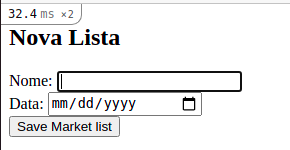

Nesse momento vale a pena dar uma olhada no código gerado. Como estou usando o chrome, bastou pertar botão direito em um dos inputs e clicar em ```inspecionar elemento```.

```html
<form action="/market_lists/new" accept-charset="UTF-8" method="post"><input type="hidden" name="authenticity_token" value="-QpO38B9pKmWed307gqQJSkYrBgz3Aej1ZD_xONlbzuzIHHJ7LLfsoJhY2NMg9lS88BjTiZyPZc7FG2yNxdpnA">
  <label>Nome</label>: <input type="text" name="market_list[name]" id="market_list_name">
  <br>
  <label>Data</label>: <input type="date" name="market_list[market_date]" id="market_list_date">
  <br>

  <input type="submit" name="commit" value="Save Market list" data-disable-with="Save Market list">
</form>
```

Repere como o ```helper``` adicionou um input do tipo hidden para segurançã e gerou os inputs com os names corretos, além do input do tipo submit gerado com diversos parâmetros.

Os helpers do rails existem justamente para facilitar essa geração de html.

Rodando os testes novamente

```
rails test test/controllers/market_lists_controller_test.rb
  6 runs, 10 assertions, 0 failures, 1 errors, 0 skips
```

Mesmo **erro** de antes. Se reparar nos testes, vai ver que o name='' está em branco. O motivo disso é que antes deu escrever a tela, eu não tinha certeza do name que seria gerado. É o tipo de coisa que eu não perco tempo "decorando". Por mais que escrever o teste antes do código seja uma boa prática, no dia a dia nem sempre é possível.

Agora que vimos o código gerado, e ter essa possibilidade é [muito importante](https://m.signalvnoise.com/paying-tribute-to-the-web-with-view-source/), podemos substituir nos testes, edite o ```test/controllers/market_lists_controller_test.rb```

```rb
test 'User should fill name and date on new form' do
  get new_market_list_path
  assert_response :success
  assert_select 'input[name=\'market_list[name]\']'
  assert_select 'input[name=\'market_list[market_date]\']'
  assert_select 'form[action=\'/market_lists\']'
end
```

Rodando os testes novamente.

```sh
rails test test/controllers/market_lists_controller_test.rb
6 runs, 12 assertions, 1 failures, 0 errors, 0 skips
```

Agora nosso teste está apontando que nosso formulário está apontando para a URL errada. Isso porque nós não passamos um objeto da classe MarketList para o form_for.

Vamos editar a actio ```new``` do nosso controller ```MarketListsController``` para:

```rb
  def new
    @market_list = MarketList.new
  end
```

E nossa view para:

```erb
<h2>Nova Lista</h2>

<%= form_for @market_list do |f| %>
  <label>Nome</label>: <%= f.text_field :name %>
  <br />
  <label>Data</label>: <%= f.date_field :market_date %>
  <br />
  <%= f.submit %>
<% end %>
```

Olhando o código gerado:

```html
<form class="new_market_list" id="new_market_list" action="/market_lists" accept-charset="UTF-8" method="post"><input type="hidden" name="authenticity_token" value="E1jW2-80-yH__HHmBdL4CcoQqPEiRywV-nwJrBy87xRZcunNw_uAOuvkz3GnW7F-EMhnpzfpFiEU-JvayM7psw">
  <label>Nome</label>: <input type="text" name="market_list[name]" id="market_list_name">
  <br>
  <label>Data</label>: <input type="date" name="market_list[market_date]" id="market_list_market_date">
  <br>
  <input type="submit" name="commit" value="Create Market list" data-disable-with="Create Market list">
</form>
```

Perfeito, agora a action está apontando para a url da nossa action ```create```, tudo através do poder da convenção sobre configuração do rails.

Rodando os testes novamente:

```sh
rails test test/controllers/market_lists_controller_test.rb
  6 runs, 14 assertions, 0 failures, 0 errors, 0 skips
```

Repare que o nosso % de cobertura de testes caiu por conta que o Rails roda testes em [paralelo](https://edgeguides.rubyonrails.org/testing.html#parallel-testing). Para ajustar esse ponto, precisamos alterar a configuração do Simplecov para ele concatenar o resultado de cada processo que ele abre para executar os testes em paralelo.

Par aisso, temos somente que alterar o código do ```test_helper.rb``` para:

```rb
(...)

module ActiveSupport
  class TestCase
    # Run tests in parallel with specified workers
    parallelize(workers: :number_of_processors)

    parallelize_setup do |worker|
      SimpleCov.command_name "#{SimpleCov.command_name}-#{worker}"
    end

    parallelize_teardown do |worker|
      SimpleCov.result
    end

    # Setup all fixtures in test/fixtures/*.yml for all tests in alphabetical order.
    fixtures :all

    # Add more helper methods to be used by all tests here...
  end
end
```

Agora temos tudo no lugar para salvar os dados no nosso Banco de Dados.

---

1. https://api.rubyonrails.org/v5.2.3/classes/ActionView/Helpers/UrlHelper.html#method-i-link_to
2. https://api.rubyonrails.org/v5.2.3/classes/ActionView/Helpers/FormHelper.html#method-i-form_for
3. https://m.signalvnoise.com/paying-tribute-to-the-web-with-view-source/
4. https://github.com/simplecov-ruby/simplecov/issues/994
5. https://edgeguides.rubyonrails.org/testing.html#parallel-testing

### 10.3. Salvando no Banco

Vamos adicionar os testes para a nossa action de ```create``` no nosso teste ```MarketListsControllerTest```

```rb
  test 'Should create a new market list if market date is filled' do
    assert_difference 'MarketList.count', 2 do
      post market_lists_path, params: { market_list: { name: 'My List', market_date: '2021-05-29' } }
      post market_lists_path, params: { market_list: { name: '', market_date: '2021-05-29' } }
    end
  end

  test 'Should show market date is required if it is empty' do
    assert_difference 'MarketList.count', 0 do
      post market_lists_path, params: { market_list: { name: 'My List', market_date: '' } }
      assert_select 'li', 'Market date can\'t be blank'
    end
  end
```

Usamos o ```assert_difference``` para garantir que a quantidade de MarketList seja alterada no banco na quantidade que queremos.

Ao rodar os testes:

```sh
rails test test/controllers/market_lists_controller_test.rb
8 runs, 14 assertions, 0 failures, 2 errors, 0 skips
```

O erro se da por conta da ausência da action ```create```.
Para fazer os errors pararem de ocorrer, basta criarmos nossa action.

```rb
  def create; end
```

Agora temos 2 erros:

```sh
(...)
"MarketList.count" didn't change by 2
(...)
NoMethodError: undefined method `document' for nil:NilClass
```

O primeiro erro aponta que a quantidade de elementos não aumentou em 2. O que é esperado, dado que adicionamos um método em branco no nosso controller.

O segundo erro aponta que não conseguimos selecionar um elemento na tela, pois não renderizamos tela nenhuma.

Para corrigir o primeiro erro, precisamos salvar as informações no banco de dados. Para isso, o ```ActiveRecord``` disponibiliza uma coleção de métodos de [persistência](https://api.rubyonrails.org/v6.1.3.2/classes/ActiveRecord/Persistence.html).

No nosso caso em específico, vamos utilizar o método ```save```, que tenta salvar o objeto que temos no banco, retornando ```true``` caso o mesmo salve com sucesso, ou ```false``` caso algo de errado.

Para chamar o método ```save``` precisamos instanciar o nosso objeto com as informações que vem do parâmetro. Para pega-las, o controller já possui uma variável ```params``` que contem as informações.

Para verificar as informações que estão vindo nessa varíavel, vamos forçar um erro na mesma.

```rb
  def create
    raise params.inspect
  end
```

Ao rodar os testes novamente:

```sh
RuntimeError: #<ActionController::Parameters {"market_list"=>{"name"=>"My List", "market_date"=>"2021-05-29"},    "controller"=>"market_lists", "action"=>"create"} permitted: false>
```

Repare que ariável params, possui um um hash (dicionário de chave valor) dentro dela justamente com as informações que precisamos. Mas a mesma está marcada com ```permitted``` false.

O ```permitted``` indica para o Rails que ele não pode atribuir em massa as informações que ele precisa. O motivo disso é evitar que o usuário passe mais campos do que o permitido para o mesmo.

Imagine por exemplo que o usuário force a requisição trazer o atributo ```created_at``` e com isso ele diga que na verdade, a lista foi criada ano passado.

Ou pior, imagine que um usuário tenha um atributo admin e que através de uma requisição ele consiga mudar esse atributo para true simplesmente porque aceitamos qualquer parâmetro nessa requisição.

Na verdde, isso [já ocorreu](http://homakov.blogspot.com/2012/03/how-to.html) com um dos maiores sites que usam Rails, o Github, e justamente por isso o [```StrongParameters```](https://edgeapi.rubyonrails.org/classes/ActionController/StrongParameters.html) foi criado.

Para transformar o nosso parâmetro em seguro e dizer exatamente quais campos queremos aceitar naquela requisição (no nosso caso 'name' e 'market_date'), podemos seguir a documentação do ```StrongParameters``` e usar os métodos ```require``` e ```permit```.

```rb
  def create
    raise params.require(:market_list).permit(:name, :market_date).inspect
  end
```

Rodando os testes novamente:

```sh
#<ActionController::Parameters {"name"=>"My List", "market_date"=>"2021-05-29"} permitted: true>
```

Perfeito, exatamente os dados que precisamos e com  ```permitted``` igual a true. Podemos alterar o código agora para iniciar o nosso objeto com os dados.

```rb
  def create
    @market_list = MarketList.new(params.require(:market_list).permit(:name, :market_date))
    @market_list.save
  end
```

Ao rodar os testes novamente, temos que o primeiro erro foi corrigido (o banco aumentou o número de registros em 2), mas o segundo erro mudou para:

```sh
  ActiveRecord::NotNullViolation: SQLite3::ConstraintException: NOT NULL constraint failed: market_lists.market_date
```

Isso ocorreu pois, na nossa migração, colocamos que a coluna market date não poderia ser em branco. Nós tratamos isso no banco de dados (última camada), mas não tratamos na nossa aplicação.

---

1. https://api.rubyonrails.org/v6.1.3.2/classes/ActiveRecord/Persistence.html
2. http://homakov.blogspot.com/2012/03/how-to.html
3. https://edgeapi.rubyonrails.org/classes/ActionController/StrongParameters.html

#### 10.3.1. Validações

O Rails possui toda uma camada de [validações de dados](https://guides.rubyonrails.org/active_record_validations.html), ela permite trazer para aplicação, as validações necessárias para garantir a integridade dos nossos dados, além de permitir responder para o usuário com uma mensagem muito mais amigável do que um erro do banco de dados.

Como exemplo, iremos usar a validação de ```presence```, mas aconselho fortemente ler as validações padrões, além de claro como criar suas validações ```customizadas``` diretamente na documentação.

Primeiro vamos escrever o nosso teste no ```MarketListTest```

```rb
class MarketListTest < ActiveSupport::TestCase
  test "Should not be valid without market_date" do
    refute MarketList.new(market_date: nil, name: 'Need buy something').valid?
  end

  test "Should be valid with market_date and without name" do
    assert MarketList.new(market_date: Date.current, name: nil).valid?
  end
end
```

Rodando o comando ```rails test test/models/market_list_test.rb``` temos que mesmo no caso que o market_date é nulo, o método ```valid?``` está retornando ```true```. Para mudar isso, precisamos adicionar a nossa validação no modelo.

```rb
class MarketList < ApplicationRecord
  validates :market_date, presence: true
end
```

Ao rodar o comando novamente, todos os testes devem ter passado.

---

1. https://guides.rubyonrails.org/active_record_validations.html


#### 10.3.2. Callbacks

Nesse momento, você pode se perguntar se devemos chamar o método ```.valid?``` antes de tentar salvar no controller, algo como:

```rb
  def create
    @market_list = MarketList.new(params.require(:market_list).permit(:name, :market_date))
    if @market_list.valid?
      @market_list.save
    end
  end
```

A resposta para essa dúvida é **não**. O rails, ao salvar um objeto no banco, passa par uma sequência de [callbacks](https://guides.rubyonrails.org/active_record_callbacks.html#available-callbacks).

Ao criar um objeto, os callbacks são:

```rb
  before_validation
  after_validation
  before_save
  around_save
  before_create
  around_create
  after_create
  after_save
  after_commit / after_rollback
```

É possível rodar código em qualquer um desses callbacks, por exemplo, após ```commitar``` no banco, enviar um e-mail. Mas no nosso caso agora, o importante é que antes do ```after_validation``` e depois do ```before_validation```, o próprio rails roda o comando ```.valid?```, interrompendo os próximos callbacks se o mesmo retornar ```false```.

Vale a nota que, caso você queira pular as validações por algum motivo, é possível chamar o método ```.save(validate: false)``` e com isso os callbacks ```before_validation``` e ```after_validation``` não serão chamados.

---

1. https://guides.rubyonrails.org/active_record_callbacks.html#available-callbacks

#### 10.3.3. Voltando ao controller

Agora que temos o nosso modelo sendo validado corretamete, podemos retornar ao nosso controller e rodar os testes novamente.

```sh
rails test test/controllers/market_lists_controller_test.rb
  Error:
  MarketListsControllerTest#test_Should_show_market_date_is_required_if_it_is_empty:
  NoMethodError: undefined method `document' for nil:NilClass
```

Voltamos a ter novamente o erro inicial, com isso sabemos que pelo menos não estamos mais tentando salvar no banco.
Para resolver esse teste em específico, precisamos renderizar novamente a view da action new.

Lembrando, por padrão o rails renderiza a view com o mesmo nome da action, mas é possível mudar isso com o método ```render```.

```rb
  def create
    @market_list = MarketList.new(params.require(:market_list).permit(:name, :market_date))
    @market_list.save
    render :new
  end
```

Ao rodar os testes, temos que agora que na view nós não temos a mensagem de erro.

Uma boa prática, segundo a nngroup, é renderizar o [erro próximo ao campo](https://www.nngroup.com/articles/errors-forms-design-guidelines/).

Para atender esse requisito, iremos alterar a nossa ```new.html.erb``` para:

```erb
  <h2>Nova Lista</h2>

  <%= form_for @market_list do |f| %>
    <label>Nome</label>: <%= f.text_field :name %>
    <br />
    <label>Data</label>: <%= f.date_field :market_date %>

    <% if @market_list.errors.full_messages_for(:market_date).any? %>
      <ul>
        <% @market_list.errors.full_messages_for(:market_date).each do |error_message| %>
          <li>
            <%= error_message %>
          </li>
        <% end %>
      </ul>
    <% end %>

    <br />
    <%= f.submit %>
  <% end %>
```

No código acima, verificar se existe alguma mensagem de erro para o campo ```market_date```, se tiver, interamos sobre a mesma usando o ```each``` e colocamos na view a mensagem dentro de uma tag ```li```.

Rodando os nossos testes temos agora que todos estão passando.

Nesse momento é uma boa hora para rodar nosso servidor e simular manualmente nossa tela.

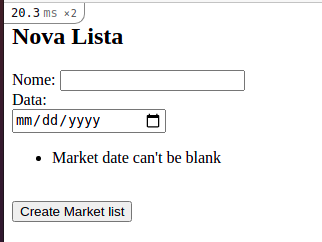

Um dos pontos que voce vai perceber é que o input da data foi para baixo do label, isso se deve pois o rails adicionou uma ```div``` ao seu redor.

Dado que o rails está manipulando o input, começamos a nos perguntar se temos uma maneira mais "automática" de adicionar as mensagens de error, se não, para cada campo vamos ter que adicionar um if parecido com o de cima. E o pior, se a gente no futuro quiser substituir o ul/li por qualquer outra tag, vamos ter que fazer o mesmo em todas as nossas telas.

E a resposta é sim, o rails por padrão, como já dito, altera o nosso input e empacta ele com uma div com classe ```field_with_errors```. Mas como tudo no rails, é possível mudar o padrão para o que queremos para nossa aplicação.

No nosso arquivo ```application.rb``` vamos adicionar o código:

```rb
(...)
module SimpleMarketList
  class Application < Rails::Application
    (...)
    ActionView::Base.field_error_proc = proc do |html_tag, instance_tag|
      html = [html_tag.html_safe]

      object = instance_tag.object
      errors_messages = object.errors.full_messages_for(instance_tag.instance_variable_get("@method_name"))

      if errors_messages.any?
        html << '<ul>'.html_safe

        errors_messages.each do |message|
          html << '<li>'.html_safe
          html << message
          html << '</li>'.html_safe
        end

        html << '</ul>'.html_safe
      end

      instance_tag.safe_join(html) # avoid html injection on error message.
    end
  end
end
```

O método acima lista as mensagens de erro de maneira segura na [view](https://www.rubydoc.info/docs/rails/4.1.7/ActionView/Helpers/OutputSafetyHelper#safe_join-instance_method). E agora podemos remover o código específico da nossa view ```new.html.erb```, ficando com:

```erb
  <h2>Nova Lista</h2>

  <%= form_for @market_list do |f| %>
    <label>Nome</label>: <%= f.text_field :name %>
    <br />
    <label>Data</label>: <%= f.date_field :market_date %>
    <br />
    <%= f.submit %>
  <% end %>
```

Ao rodar os nossos testes, percebemos que todos ainda estão funcionando.

Porém ao rodar o servidor e salvar um lista válida, percebemos que nada acontece, e pior, nossos testes também não previam esse comportamento.

---

1. https://www.nngroup.com/articles/errors-forms-design-guidelines/
2. https://www.rubydoc.info/docs/rails/4.1.7/ActionView/Helpers/OutputSafetyHelper#safe_join-instance_method


#### 10.3.4. Redirecionando a Requisição

A nossa action ```create```, após salvar, sempre renderiza o a view ```new```, o que queremos é que, se a tentativa de salvar os dados funcione, o usuário seja redirecionado para a tela de index. Além disso, queremos garantir que uma mensagem de sucesso apareça na tela:

```rb
  test 'Should create a new market list if market date is filled' do
    assert_difference 'MarketList.count', 2 do
      post market_lists_path, params: { market_list: { name: 'My List', market_date: '2021-05-29' } }
      post market_lists_path, params: { market_list: { name: '', market_date: '2021-05-29' } }
    end
    follow_redirect!
    assert_select 'a', text: 'Nova lista de Mercado'
    assert_select 'p', 'Nova lista criada com Sucesso'
  end
```

Rodando os nossos testes, temos:

```sh
MarketListsControllerTest#test_Should_create_a_new_market_list_if_market_date_is_filled:
RuntimeError: not a redirect! 200 OK
```

Agora sim nossos testes mostram que a página não foi redirecionada, e sim, retornou o status 200. Para resolver esse caso de uso, o Rails possui o método [```redirect_to```](https://api.rubyonrails.org/v6.1.3.2/classes/ActionController/Redirecting.html#method-i-redirect_to).

Vamos adicionar o mesmo no nosso fluxo de criação:

```rb
  def create
    @market_list = MarketList.new(params.require(:market_list).permit(:name, :market_date))

    if @market_list.save
      redirect_to action: :index
    else
      render :new
    end
  end
```

Ao rodar nossos testes novamente teremos que a mensagem de sucesso não apareceu na tela.

---

1. https://api.rubyonrails.org/v6.1.3.2/classes/ActionController/Redirecting.html#method-i-redirect_to

#### 10.3.5. Guardando o estado da sua aplicação

A action index não possui, nesse momento, nenhuma maneira de saber que uma nova lista de mercado foi sava com sucesso na action anterior. O Rails por padrão não guarda nenhum estado da sua aplicação.

Porém, como nesse caso, é necessário guardar essa informação, mesmo por um período pequeno de tempo. Para essa situação temos algumas formadas de resolver:

1) [cookies](https://guides.rubyonrails.org/action_controller_overview.html#cookies): São uma estrutura de Chave-Valor que são salvas no Browser do Usuário, enquanto o usuário não "limpar" os cookies, eles estarão lá. Existem limitações de espaço que o próprio Browser coloca, mas os cookies são muito úteis para, por exemplo, lembrar qual era o filtro que um usuário estava realizando antes de entrar em uma determinada página. Os cookies também podem ser acesso no cliente, através de Javascript.

2) [sessions](https://guides.rubyonrails.org/action_controller_overview.html#session): A session é uma segunda estrutura de chave-valor que existem para cada usuário e enquanto a sessão do usuário existir. Um exemplo, quando o usuário faz logout, a session deixa de existir. Ela pode ser armazenada dentro dos cookies, ou em outras camadas, como no próprio banco de dados. A informação fica criptografada, não podendo ser acessada pelo cliente.

3) [flash](https://guides.rubyonrails.org/action_controller_overview.html#the-flash): Já flash é um caso específico da session que só existe durante o ciclo de vida da requisição. Assim que a requisição finaliza, o flash também é apagado.

O flash é examente o que queremos para resolver o nosso problema, passar a informação da action ```create```, usar ela na view da action ```index``` e depois descarta-la.

Pra isso, vamos alterar mais uma vez o nosso controller:

```rb
  def create
    @market_list = MarketList.new(params.require(:market_list).permit(:name, :market_date))

    if @market_list.save
      flash[:success] = 'Nova lista criada com Sucesso'
      redirect_to action: :index
    else
      render :new
    end
  end
```

E agora usar ela na nossa view do index

```erb
<% if flash[:success].present? %>
  <p><%= flash[:success] %></p>
<% end %>

<h1>Suas listas de Mercado</h1>
<%= link_to 'Nova lista de Mercado', new_market_list_path %>
<p>Você ainda não possui nenhuma lista</p>
```

Rodando o nosso teste, sucesso.

Porem ao rodar o servidor:


A nossa mensagem de sucesso apareceu, mas nenhuma lista de mercado está aparecendo na tela.

---

1. https://guides.rubyonrails.org/action_controller_overview.html#cookies
2. https://guides.rubyonrails.org/action_controller_overview.html#session
3. https://guides.rubyonrails.org/action_controller_overview.html#the-flash


## 11. Buscando no Banco

Voltando a tela de index, vemos que a nossa lista de mercado ainda não está aparecendo na nossa tabela,

Para isso, temos que buscar essas informações no banco para mostrar as mesmas na tela.

### 11.1. Fixtures

Seguindo a nossa estratégia de testar primeiro, precisamos que nosso banco esteja preenchido.

Já tivemos que lidar anteriormente com Fixtures nesse livro, agora vamos nos aprofundar um pouco dentro delas.

Como já disse, a ideia da Fixtures é que você consiga montar os cenários de testes que o seu banco precisa ter para reproduzir as situações dos usuários.

As fixtures são uma técnica que diverge um pouco do que o TDD prega de "não encostar no banco de dados".

A verdade é que a uns 20 anos, o banco de dados era lento o que fazia essa ideia fazer sentido. Hoje rodar um postgres/mysql na máquina, com SSD, faz seus testes demorarem poucos minutos para rodar em uma aplicação grande. Por exemplo, [no Basecamp o a suit inteira de testes roda em 5 minutos](https://dhh.dk/2014/slow-database-test-fallacy.html).

Além de ser rápido o suficiente, usar fixtures evita que você adicione camadas desnecessárias na sua aplicação, somente para evitar esse pequeno gargalo.

E mesmo assim, todas essas camadas iriam esconder o problemas que só o banco vai ter como por exemplo, index, etc. Já apresentado nesse livro.

Vamos editar nossa fixture de market_list para adicionar nome que é um dado que ainda não possuímos.

```test/fixtures/market_lists.yml```
```yml
one:
  name: 'Market List One'
  market_date: '2021-01-01'
#
two:
  name: 'Market List Two'
  market_date: '2020-01-01'
```

Pronto, agora podemos escrever nossos testes considerando que existem essas duas listas de mercado no banco de dados.

Para garantir que o usuário agora veja as listas de mercado correta na tela, vamos testar se o nome das 2 listas aparecem na view e a data está formatada.

Editando o nosso teste de controller ```test/controllers/market_lists_controller_test.rb``` agora:

```rb
  test 'Should list market list name and date on index' do
    get market_lists_path
    assert_response :success

    assert_select 'tr' do
      assert_select 'td', text: 'Market List One'
      assert_select 'td', text: '01/01/2021'
    end

    assert_select 'tr' do
      assert_select 'td', text: 'Market List Two'
      assert_select 'td', text: '01/01/2020'
    end
  end
```

Rodando nossos testes agora:

```sh
rails test
  Expected at least 1 element matching "tr", found 0..
```

Ótimo, agora temos um teste que garante que nossas listas vão estar na tela, próximo passo, é fazer os testes passarem.

-------------

1. https://dhh.dk/2014/slow-database-test-fallacy.html

### 11.2. Fazendo query no banco

O active record tem toda uma api de [consulta do banco](https://guides.rubyonrails.org/active_record_querying.html).

Que permite desde query simples, como usar where. Até fazer joins comeplexos, usando as relações definidas no próprio Rails.

Nesse primeiro momento, vamos somente retornar todas as listas cadastradas no banco.

```app/controllers/market_lists_controller.rb```
```rb
(...)
def index
  @market_lists = MarketList.all # I really love rails code
end
(...)
```

Assim como já fizemos nas outras actions, definimos uma variável de instância para podermos utilizar a mesma na view.

-------------

1. https://guides.rubyonrails.org/active_record_querying.html

### 11.3. Mostrando o resultado para o usuário

E agora vamos somente mostrar a mensagem de ```Você ainda não possui nenhuma lista``` se não tiver nenhum elemento na lista.

```app/views/market_lists/index.html.erb```
```erb
(...)
<% if @market_lists.any? %>
<% else %>
  <p>Você ainda não possui nenhuma lista</p>
<% end %>
(...)
```

Ao rodar os testes, veremos que verificaram se a mensagem existe quebraram. Isso porque nós temos listas de mercado no nosso banco.
Para fazer os testes funcionarem, podemos garantir que para esse teste, o método all não retorne nenhum elemento.

```test/controllers/market_lists_controller_test.rb```
```rb
  (...)
  test "Should show you don't have any list if don't have any list if access root" do
    MarketList.stub :all, MarketList.none do
      get root_path
      assert_response :success
      assert_select 'p', text: 'Você ainda não possui nenhuma lista'
    end
  end

  test "Should show you don't have any list if don't have any list if access specific url" do
    MarketList.stub :all, MarketList.none do
      get market_lists_path
      assert_response :success
      assert_select 'p', text: 'Você ainda não possui nenhuma lista'
    end
  end
  (...)
```

Nesse caso, usamos uma técnica de teste que se chama stub. Ela serve para garantir o retorno de um determinado método que seu teste vai chamar internamente. Assim, conseguimos ter maior controle do contexto do nosso teste. Nesse caso, sempre que a gente chaamr MarketList.stub, vamos ter o retorno de MarketList.none, que é exatamente o que queremos para esses testes.

Aconselho a ler o [excelente artigo](https://martinfowler.com/articles/mocksArentStubs.html) do Martin Fowler sobre as diferentes técnicas para escrever testes.

Por fim, para usar o stub, precisamos no ```test_helper.rb``` carregar essa parte do minitest que não vem por padrão no ```rails/test_help``` que já é carregado no arquivo.

```rb
(...)
Rails.application.eager_load!

ENV['RAILS_ENV'] ||= 'test'

require_relative '../config/environment'
require 'rails/test_help'
require 'minitest/autorun'
(...)
```

Ao rodar novamente os testes:

```sh
rails test
  (...)
  Expected at least 1 element matching "tr", found 0..
  11 runs, 23 assertions, 1 failures, 0 errors, 0 skips
```

Voltamos a ter somente o teste de listar os elementos que temos no banco falhando.

Agora, vamos implementar nossa tabela de lista de mercado.

```app/views/market_lists/index.html.erb```
```erb
(...)
<% if @market_lists.any? %>
  <table>
    <thead>
      <th>ID</th><th>Nome</th><th>Data</th>
    </thead>
    <tbody>
      <% @market_lists.each do |ml| %>
        <tr>
          <td><%= ml.id %></td><td><%= ml.name %></td><td><%= ml.market_date %></td>
        </tr>
      <% end %>
    </tbody>
  </table>
<% else %>
  <p>Você ainda não possui nenhuma lista</p>
<% end %>
(...)
```

Ao rodar novamente os testes

```sh
rails test test/controllers/market_lists_controller_test.rb
<01/01/2021> expected but was
<298486374>..
```

---

1. https://martinfowler.com/articles/mocksArentStubs.html

### 11.4. Localizando nossa aplicação

Vemos que ainda temos um erro ocorrendo, isso porque ele não conseguiu encontrar a data, mesmo tendo colocando ela na tabela.
Para entender o que está ocorrendo, podemos rodar o servidor (```rails s```) e verificar como a data está aparecendo.


Podemos ver que, apesar da tabela conter a data, ela não está no formato que queremos.

Para formatar a data, o rails traz uma poderosa ferramente de [internacionalização](https://guides.rubyonrails.org/i18n.html), que permite tanto traduzir palavras de acordo com o usuário (tradução), quanto mostrar os dados no formato que o usuário está acostumado (localização).

```app/views/market_lists/index.html.erb```
```erb
(...)
  <% @market_lists.each do |ml| %>
    <tr>
      <td><%= ml.id %></td><td><%= ml.name %></td><td><%= l ml.market_date %></td>
    </tr>
  <% end %>
(...)
```

A única alteração que fizemos foi adicionar o ```l``` e vamos colocar a linguagem pt-BR como a padrão da nossa aplicação no arquivo ```application.rb```

```rb
module SimpleMarketList
  class Application < Rails::Application
    (...)
    I18n.available_locales = [:'pt-BR']
    I18n.default_locale = :'pt-BR'
  end
end
```

Agora podemos criar dentro da pasta ```config/locales``` o arquivo ```pt-BR.yml```

```yml
pt-BR:
  date:
    formats:
      default: "%d/%m/%Y"
```

Ao reiniciar o servidor, temos:

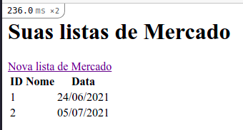

Agora rodando os testes temos:

```sh
rails test
Failure:
MarketListsControllerTest#test_Should_show_market_date_is_required_if_it_is_empty [/home/victorcampos/Workspace/v360/simple_market_list/test/controllers/market_lists_controller_test.rb:59]:
<Market date can't be blank> expected but was
<Market date translation missing: pt-BR.activerecord.errors.models.market_list.attributes.market_date.blank>..
Expected 0 to be >= 1.


rails test test/controllers/market_lists_controller_test.rb:58
```

---

1. https://guides.rubyonrails.org/i18n.html

### 11.5. Traduzindo a aplicação

Podemos ver que o teste que esperava uma mensagem em inglês, agora está achando um erro de tradução.
Isso porque todas as mensagem do framework, vem por padrão na linguagem do usuário, no nosso caso, 'pt-BR'. Só que no nosso arquivo não existe nenhuma mensagem de tradução para a chave ```pt-BR.activerecord.errors.models.market_list.attributes.market_date.blank```.

Vamos adicionar:

```pt-BR.yml```
```yml
pt-BR:
  activerecord:
    errors:
      models:
        market_list:
          attributes:
            market_date:
              blank: não pode ficar em branco
```

Repare que segue a mesma ordem da chave de tradução. Agora vamos mudar o texto dos testes para português:
```test/controllers/market_lists_controller_test.rb```
```rb
  test 'Should show market date is required if it is empty' do
    assert_difference 'MarketList.count', 0 do
      post market_lists_path, params: { market_list: { name: 'My List', market_date: '' } }
      assert_select 'li', 'Market date não pode ficar em branco'
    end
  end
```

Ao rodar os testes:
```sh
rails test
11 runs, 28 assertions, 0 failures, 0 errors, 0 skips
```

Pronto. Todos os testes passando novamente.
Mas você deve estar se perguntando, será que tenho que traduzir na mão todas as mensagens padrões do rails para todas as linguas que vou trabalhar?

A resposta é não, alguém já teve esse trabalho e compartilhou na ótima gema ```rails-i18n```. Indicada na própria documentação do Rails ela já trás por padrão uma série de traduções prontas em dezenas de línguas diferentes.

```Gemfile```
```rb
  (...)
  gem 'rails-i18n'
```

Rodamos o ```bundle``` e podemos apagar o conteúdo do nosso ```pt-BR.yml``` deixando somente a chave ```pt-BR:```

Ao rodar os testes:
```sh
rails test
11 runs, 28 assertions, 0 failures, 0 errors, 0 skips
```

Vemos que todos os testes continuam passando.

## 12. Editando uma entrada na Lista

Obviamente o usuário pode errar as informações que ele inseriu na lista e querer editar e essa é nossa próxima etapa da jornada.

Primeiramente, como já vimos ao longo desse livro, vamos adicionar os testes para garantir que o botão editar exista na nossa lista de tarefas.

```rb
# frozen_string_literal: true

require 'test_helper'

class MarketListsControllerTest < ActionDispatch::IntegrationTest
  (...)
  test 'Should show edit link on market list index' do
    get market_lists_path
    assert_response :success

    MarketList.all.each do |ml|
      assert_select "a[href='/market_lists/#{ml.id}/edit']"
    end
  end
  (...)
end
```

Como viamos anteriormente, queremos garantir que cada lista de mercado no nosso banc, o link que leva para editar a mesma existe.
O formato do link é possível verificar rodando ```rails routes``` como vimos no capítulo 8.

Rodando nossos testes:

```sh
rails test
Failure:
MarketListsControllerTest#test_Should_show_edit_link_on_market_list_index [/home/victorcampos/Workspace/v360/simple_market_list/test/controllers/market_lists_controller_test.rb:85]:
Expected at least 1 element matching "a[href='/market_lists/298486374/edit']", found 0..
Expected 0 to be >= 1.


rails test test/controllers/market_lists_controller_test.rb:80
```

Agora vamos adicionar na nossa view ```/market_lists/index.html.erb``` assim como fizemos com o link de new.

```erb
(...)
  <table>
    <thead>
      <th>ID</th><th>Nome</th><th>Data</th><th></th>
    </thead>
    <tbody>
      <% @market_lists.each do |ml| %>
        <tr>
          <td><%= ml.id %></td><td><%= ml.name %></td><td><%= l ml.market_date %></td><td><%= link_to 'Editar', edit_market_list_path(ml) %></td>
        </tr>
      <% end %>
    </tbody>
  </table>
(...)
```

Rodando nosso teste novamente

```sh
rails test
12 runs, 31 assertions, 0 failures, 0 errors, 0 skips
```

Pronto, agora podemos rodar o nosso servidor e ver como ficou:

```sh
rails s
```

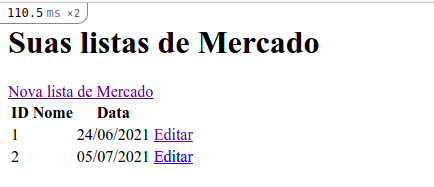

Agora, basta clicar no botão edit:

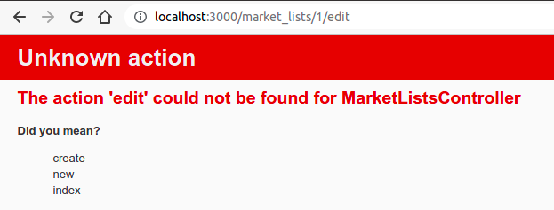

E agora temos a aplicação reclamando que a action do edit não existe.

### 12.1. Definindo nossa action edit

Diferente da nossa action ```new```, onde a gente inicializou uma lista do zero, nós queremos carregar os dados que já existe no banco para que nosso formulário já tenha os dados que nós já previamente salvamos.

Assim o usuário não terá que se lembrar da informação que ele colocou previamente.
Então, nosso teste vai ser muito parecido com o nosso de ```new```, porém garantindo que o conteúdo preenchido no banco vai estar preenchido nos campos.

Para escrever esse teste, vamos ter que usar uma outra [funcionalidade das fixtures](https://guides.rubyonrails.org/testing.html#fixtures-are-active-record-objects), ela permite que a gente carregue um elemento do nosso banco, passando a chave que definimos no arquivo .yml.

O rails por padrão vai criar os métodos com o nome dos arquivos das fixtures sem o .yml (no nosso caso market_lists), que recebe por parâmetro a chave que foi definida no yml.

Nossa fixture está assim nesse momento:

```test/fixtures/market_lists.yml```
```yml
one:
  name: 'Market List One'
  market_date: '2021-01-01'
#
two:
  name: 'Market List Two'
  market_date: '2020-01-01'
```

Dessa forma nosso teste fica

```rb
# frozen_string_literal: true

require 'test_helper'

class MarketListsControllerTest < ActionDispatch::IntegrationTest
  (...)
  test 'User should see previous name and date on edit form' do
    market_list = market_lists(:one)
    get edit_market_list_path(market_list)
    assert_response :success
    assert_select 'input[name=\'market_list[name]\'][value=?]', market_list.name
    assert_select 'input[name=\'market_list[market_date]\'][value=?]', market_list.market_date.to_s
    assert_select "form[action=\'/market_lists/#{market_list.id}\']"
  end
  (...)
end
```

```sh
rails test test/controllers/market_lists_controller_test.rb
  Error:
  MarketListsControllerTest#test_User_should_see_previous_name_and_date_on_edit_form:
  DRb::DRbRemoteError: The action 'edit' could not be found for MarketListsController
  Did you mean?  create
                new
                index (AbstractController::ActionNotFound)
      test/controllers/market_lists_controller_test.rb:91:in `block in <class:MarketListsControllerTest>'
```

E nosso teste agora está apontando o mesmo erro que recebemos ao clicar no link de Editar

Para corrigir o erro anterior, vamos no nosso ```MarketListsController``` criar a nossa action.

```rb
# frozen_string_literal: true

class MarketListsController < ApplicationController
  (...)
  def edit
  end
end
```

Rodando novamente os testes:

```sh
rails test test/controllers/market_lists_controller_test.rb
E

  Error:
  MarketListsControllerTest#test_User_should_see_previous_name_and_date_on_edit_form:
  ActionController::MissingExactTemplate: MarketListsController#edit is missing a template for request formats: text/html
      test/controllers/market_lists_controller_test.rb:91:in `block in <class:MarketListsControllerTest>'
```

Agora, temos o erro que o arquivo da view não existe. Vamos resolver o mesmo no próximo capítulo.

----

1. https://guides.rubyonrails.org/testing.html#fixtures-are-active-record-objects

#### 12.1.1. Alterando a view

Como já criamos anteriormente a tela de criação (```new.html.erb```), vamos reaproveitar a mesma estrutura para nossa tela de edição.

Vamos copiar a mesma para o arquivo ```edit.html.erb``` (mesmo nome da action do controller), e somente editar a tag de subtítulo (h2), ficando:

```erb
<h2>Editar Lista</h2>

<%= form_for @market_list do |f| %>
  <label>Nome</label>: <%= f.text_field :name %>
  <br />
  <label>Data</label>: <%= f.date_field :market_date %>
  <br />
  <%= f.submit %>
<% end %>
```

Rodando o nosso teste novamente:

```sh
rails test test/controllers/market_lists_controller_test.rb

  Error:
  MarketListsControllerTest#test_User_should_see_previous_name_and_date_on_edit_form:
  ActionView::Template::Error: First argument in form cannot contain nil or be empty
      app/views/market_lists/edit.html.erb:3
      test/controllers/market_lists_controller_test.rb:91:in `block in <class:MarketListsControllerTest>'


  rails test test/controllers/market_lists_controller_test.rb:89
```

O erro do teste mudou, informando que o arguemnto que passamos para o form, está nulo. Realmente, se compararmos o conteúdo da action ```new``` com a ```edit```, veremos que falta iniciar a variável ```@market_list```.

Vamos fazer o mesmo que fizemos com a view, para a action:

```rb
  def edit
    @market_list = MarketList.new
  end
```

Ao rodar os testes:

```sh
rails test test/controllers/market_lists_controller_test.rb

  Failure:
  MarketListsControllerTest#test_User_should_see_previous_name_and_date_on_edit_form [/home/victorcampos/Workspace/v360/simple_market_list/test/controllers/market_lists_controller_test.rb:93]:
  Expected at least 1 element matching "input[name='market_list[name]'][value="Market List One"]", found 0..
  Expected 0 to be >= 1.


  rails test test/controllers/market_lists_controller_test.rb:89
```

Mesmo assim o nosso teste não passa, pois esperamos que o campo já esteja preenchido com o valor.

#### 12.1.2. Usando o Find

Olhando mais atentamente ao nosso teste:

```rb
  test 'User should see previous name and date on edit form' do
    market_list = market_lists(:one)
    get edit_market_list_path(market_list)
    assert_response :success
    (...)
  end
```

Podemos perceber que nós passamos como parâmetro a lista de mercado, mas na nossa action não usa essa informação em nenhum lugar.

Olhando a rota gerada para o edit_market_list, que é usada no nosso teste:

```sh
rails routes | grep edit_market_list
  edit_market_list GET    /market_lists/:id/edit(.:format) market_lists#edit
```

Podemos que ver ela é motanda com o parâmetro :id no mesmo, o rails "automaticamente" pega essa informação do objeto passado por parâmetro e adiciona na url.

E conseguimos pegar essa informação através da variável ```params``` que o próprio rails nos fornece.

Como buscar um objeto através da sua chave primária é uma operação **muito** comum, o rails fornece um método para isso, o [```find```](https://api.rubyonrails.org/classes/ActiveRecord/FinderMethods.html#method-i-find).

O método find recebe o valor da chave primária de uma classe e faz a busca por esse objeto. Quando o mesmo não é encotrado, o rails lança uma exception.

Vamos então, ao invés de iniciar um novo objeto como fizemos no new, buscar o objeto que já existe no banco utilizando o params que a url nos fornece.

```rb
  def edit
    @market_list = MarketList.find(params[:id])
  end
```

Rodando os testes temos:

```sh
rails test
.............

simple_market_list/coverage. 28 / 28 LOC (100.0%) covered.
```

Todos os nossos testes passando novamente.

-----

1. https://api.rubyonrails.org/classes/ActiveRecord/FinderMethods.html#method-i-find

#### 12.1.3. Partials

Mas lógico que copiar e colar um arquivo inteiro não é a maneira mais [DRY (Don't repeat yourself)](https://blog.ploeh.dk/2014/08/07/why-dry/) de se programar.

Como o formulário da tela de ```new``` é igual ao do ```edit```, podemos reaproveitar o código das mesmas usando as [```partials```](https://guides.rubyonrails.org/layouts_and_rendering.html#using-partials) do rails.

Vamos criar o arquivo ```_form.html.erb```(sim '_' faz parte do nome) e recortar o conteúdo do form para o mesmo:

```app/views/market_lists/_form.html.erb```
```erb
<%= form_for @market_list do |f| %>
  <label>Nome</label>: <%= f.text_field :name %>
  <br />
  <label>Data</label>: <%= f.date_field :market_date %>
  <br />
  <%= f.submit %>
<% end %>
```

E vamos renderizar esse conteúdo, tanto na nossa tela de new, quanto nossa tela de edit

```new.html.erb```
```erb
<h2>Nova Lista</h2>
<%= render 'form' %>
```

```edit.html.erb```
```erb
<h2>Editar Lista</h2>
<%= render 'form' %>
```

!!!Mas lembre, [*duplication is far cheaper than the wrong abstraction*](https://sandimetz.com/blog/2016/1/20/the-wrong-abstraction), se por algum motivo no futuro o formulário começar a mudar e não seja igual para os 2 casos, volte atrás nessa mudança e evite uma abstração ruim!!!


Rodando novamente os testes
```sh
rails test
.............

simple_market_list/coverage. 28 / 28 LOC (100.0%) covered.
```

Agora vamos testar a nossa aplicação no Browser:

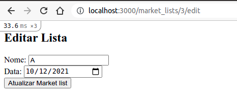

Você pode ver que o próprio Rails mudou o que estava escrito no botão para 'Atualizar' e caso você queria alterar esse comportamento, pode ser a dica dessa [resposta do stackoverflow](https://stackoverflow.com/a/6823266);

A mesma também carregou os dados do banco como valores padrões dos campos na tela, o que era esperado dado os testes estão passando =), mas ao clicar no botão de atualizar o mesmo da um erro.

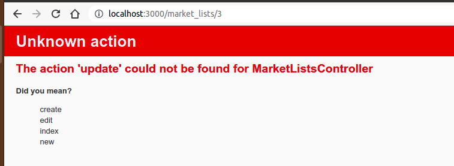

-----

1. https://blog.ploeh.dk/2014/08/07/why-dry/
2. https://guides.rubyonrails.org/layouts_and_rendering.html#using-partials
3. https://sandimetz.com/blog/2016/1/20/the-wrong-abstraction
4. https://stackoverflow.com/a/6823266

### 12.2. Atualizando um Registro

Assim como fizemos com a action de ```create```, precisamos fazer com a action de ```update```:

Vamos definir primeiramente nossos testes:

```rb
  test 'Should update a exist market list if market date is filled' do
    market_list = market_lists(:one)

    assert_difference 'MarketList.count', 0 do
      put market_list_path(market_list), params: { market_list: { name: 'My List', market_date: '2021-05-29' } }
      market_list.reload # recarrega o objeto do banco de dados
      assert_equal 'My List', market_list.name
      assert_equal Date.parse('2021-05-29'), market_list.market_date

      put market_list_path(market_list), params: { market_list: { name: '', market_date: '2021-05-29' } }
      market_list.reload # recarrega o objeto do banco de dados
      assert_equal '', market_list.name
      assert_equal Date.parse('2021-05-29'), market_list.market_date
    end

    follow_redirect!

    assert_select 'a', text: 'Nova lista de Mercado'
    assert_select 'p', 'Lista editada com Sucesso'
  end

  test 'Should show market date is required on edit if it is empty' do
    market_list = market_lists(:one)

    assert_difference 'MarketList.count', 0 do
      initial_market_date = market_list.market_date
      put market_list_path(market_list), params: { market_list: { name: 'My List', market_date: '' } }

      market_list.reload # recarrega o objeto do banco de dados
      assert_equal initial_market_date, market_list.market_date

      assert_select 'li', 'Market date não pode ficar em branco'
    end
  end
```

Ao rodar os 2 testes, temos o mesmo erro que tivemos ao clicar no botão no Browser, que a action ```update``` não existe, então vamos adiciona-la:

```rb
  def update
    @market_list = MarketList.find(params[:id])
    @market_list.attributes = params.require(:market_list).permit(:name, :market_date)

    if @market_list.save
      flash[:success] = 'Lista editada com Sucesso'
      redirect_to action: :index
    else
      render :edit
    end
  end
```

Acelerando um pouco, usamos o que já aprendemos nos captulos anteriores. O ```find``` para pegar o objeto no banco, o ```params.require.permit``` para dizer para o rails quais parâmetros da url são permitidos, o método ```save``` para tentar salvar o objeto no banco, o ```flash``` para passar informação de uma requisição para a outra e o ```redirect```/```render```.

Esse é um bom momento para reler os capitulos anteriores caso alguma parte desse código gerou dúvidas.

Rodando o teste novamente:

```sh
rails test
  ...............

  simple_market_list/coverage. 35 / 35 LOC (100.0%) covered.
```

Um dado "legal" de se  verificar, depois do cominho percorrido é quantas linhas de código já escrevemos.
Conseguimos ver isso com o comando ```rails stats```.

```sh
rails stats
+----------------------+--------+--------+---------+---------+-----+-------+
| Name                 |  Lines |    LOC | Classes | Methods | M/C | LOC/M |
+----------------------+--------+--------+---------+---------+-----+-------+
| Controllers          |     42 |     32 |       2 |       5 |   2 |     4 |
| Helpers              |      8 |      4 |       0 |       0 |   0 |     0 |
| Jobs                 |      9 |      2 |       1 |       0 |   0 |     0 |
| Models               |      8 |      6 |       2 |       0 |   0 |     0 |
| Mailers              |      6 |      4 |       1 |       0 |   0 |     0 |
| Channels             |     12 |      8 |       2 |       0 |   0 |     0 |
| JavaScript           |     24 |     11 |       0 |       0 |   0 |     0 |
| Libraries            |      0 |      0 |       0 |       0 |   0 |     0 |
| Controller tests     |    132 |    107 |       1 |      13 |  13 |     6 |
| Helper tests         |      0 |      0 |       0 |       0 |   0 |     0 |
| Model tests          |     11 |      9 |       1 |       2 |   2 |     2 |
| Mailer tests         |      0 |      0 |       0 |       0 |   0 |     0 |
| Channel tests        |     15 |      5 |       1 |       0 |   0 |     0 |
| Integration tests    |      0 |      0 |       0 |       0 |   0 |     0 |
| System tests         |      0 |      0 |       0 |       0 |   0 |     0 |
+----------------------+--------+--------+---------+---------+-----+-------+
| Total                |    267 |    188 |      11 |      20 |   1 |     7 |
+----------------------+--------+--------+---------+---------+-----+-------+
  Code LOC: 67     Test LOC: 121     Code to Test Ratio: 1:1.8
```

Chegamos nessa etapa do livro, como todo o cadastro da lista de mercado, algumas validações, restrições no banco de dados, 100% de cobertura de testes, com 188 linhas de código escrita, 267 se considerarmos as linhas que o Rails escreveu para a gente.

Um custo muito barato por todas as funcionalidades que já temos.

## 13. Adicionando Itens a Lista

Agora, uma lista de mercado sem os itens que você precisa comprar não serve para muita coisa. E é isso que vamos tratar nesse capítulo.

A nossa ideia é que cada lista possa ter seus próprios itens.

### 13.1. Tela de visualização de Lista de Mercado

Para iniciar o nosso projeto, vamos criar um link na nossa tela que lista as listas de mercado que leve para o conjunto de itens.

Assim como temos o nosso botão editar, vamos adicionar um botão de "visualizar".

Vamos editar o nosso teste de mostrar o botão de editar para mostrar também o botão de 'visualizar

```rb
  (...)
  test 'Should show edit and show link on market list index' do
    get market_lists_path
    assert_response :success

    MarketList.all.each do |ml|
      assert_select "a[href='/market_lists/#{ml.id}/edit']"
      assert_select "a[href='/market_lists/#{ml.id}']"
    end
  end
  (...)
```

Com essa edição, voltar a ter um teste quebrando, para arruma-lo, iremos editar novamente a nossa view ```index.html.erb```

```html
(...)
  <td><%= ml.id %></td><td><%= ml.name %></td><td><%= l ml.market_date %></td><td><%= link_to 'Visualizar', market_list_path(ml) %> | <%= link_to 'Editar', edit_market_list_path(ml) %></td>
(...)
```

Utilizei a rota que leva para a action show do nosso controlador.

#### 13.1.1. Action show

A action show é a responsável por mostrar os detalhes de um único recurso da sua aplicação (conceito explicado no capítulo 8). Nesse momento, assim como ocorreu com as outras rotas, a mesma ainda não está implementada no nosso controlador.

Como requisito para essa tela de index, temos que a mesma deve ter:

1. [O nome e a data da lista de mercado selecionada](https://www.nngroup.com/articles/visibility-system-status/)
2. [Um botão de voltar para a tela anterior](https://www.nngroup.com/articles/user-control-and-freedom/)
3. [Uma mensagem informando que nenhum item está cadastrado até o momento](https://signalvnoise.com/archives/000375.php)
4. Um botão para cadastrar um novo item

....

---

1. https://www.nngroup.com/articles/visibility-system-status/
2. https://www.nngroup.com/articles/user-control-and-freedom/
3. https://signalvnoise.com/archives/000375.php

### 13.2. Relacionando Modelos

### 13.3. Interagindo com os Itens

## 14. Deletando uma lista Inteira

## 15. Adicionando Estilo na Aplicação

## 16. Fazendo Deploy

## 17. Conclusão

## 18. Próximo Livro (Tópicos Avançados)

Apesar de que com o conteudo desse livro já ser possível criar sistemas complexos e funcionais, o Rails ainda fornece muito mais ferramentas para deixar seus sistemas ainda mais incríveis e serão esses tópicos avançados que esatei focando no meu próximo livro: "Aprenda Rails da Maneira Fácil - Tópicos Avançados"

* Adicionando um Pipeline de Deploy
* Adicionando um usuário
* Adicionando Fotos dos Itens
* Compartilhando Lista Entre Usuários
* Atualizando a tela dinamicamente
* Sincronizando tela entre usuários
* Gerando uma aplicação mobile
